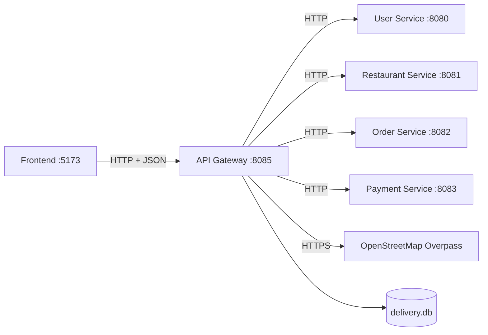
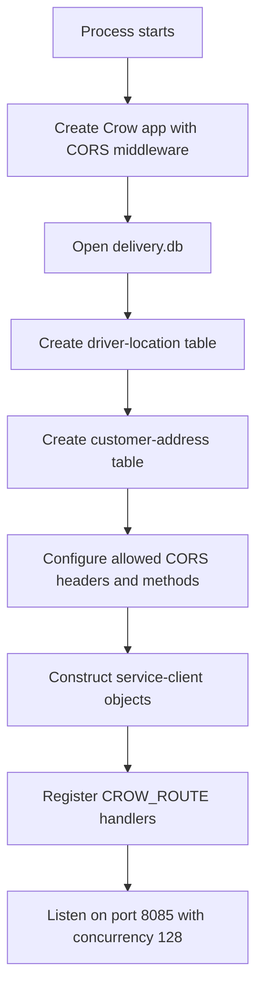
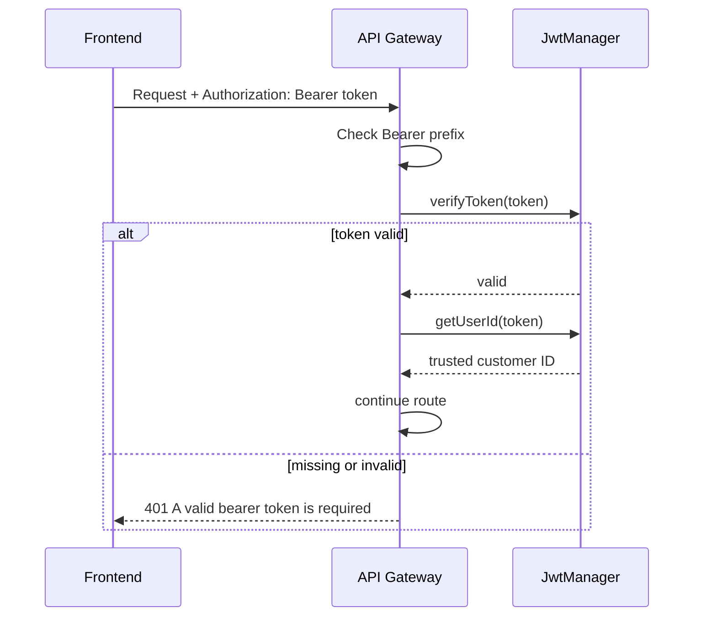
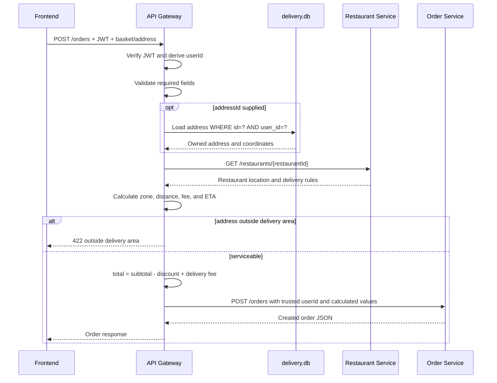
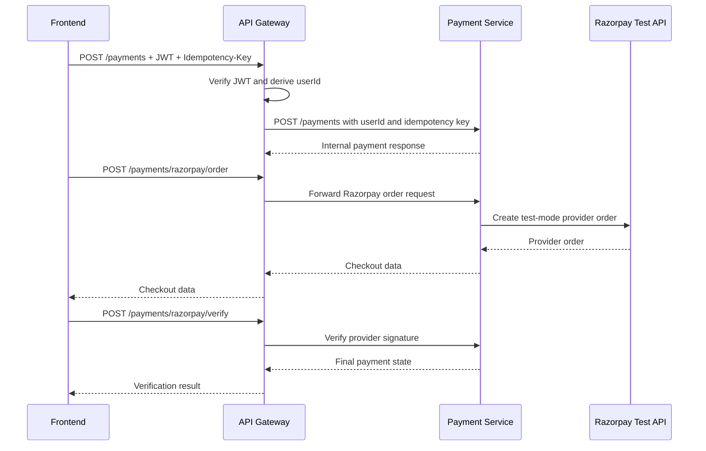
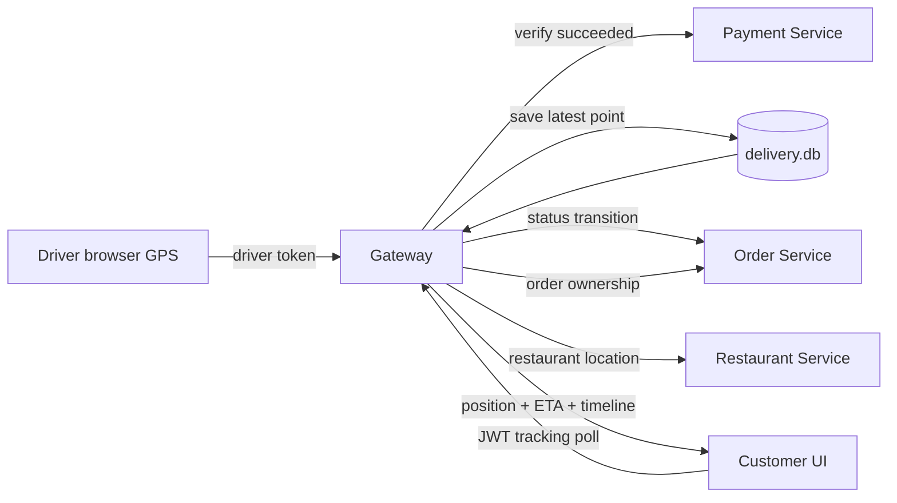

# API Gateway code-flow guide

This document explains how the FoodService API Gateway receives frontend
requests, verifies identity, calls backend microservices, combines results, and
returns an HTTP response. It describes the code that is currently compiled and
run, including its limitations.

## 1. Purpose of the gateway

The frontend should not need to know every backend service address. It sends
requests to one public backend entry point, the API Gateway on port `8085`.



The gateway has four responsibilities in the current product:

1. **Routing:** map a public route to the correct backend service.
2. **Authentication:** verify selected JWT-protected requests and derive the
   customer ID from the signed token.
3. **Orchestration:** combine restaurant, order, payment, address, and tracking
   information when one user action needs multiple operations.
4. **Gateway-owned MVP data:** store customer addresses and the latest driver
   GPS position in `delivery.db`.

The gateway is not the frontend development server. Vite serves the browser UI
on `5173`; the C++ API Gateway listens on `8085`.

## 2. Compiled source files

`services/ApiGateway/CMakeLists.txt` builds these files:

```text
services/ApiGateway/
├── CMakeLists.txt
├── include/
│   ├── DeliveryQuote.h
│   └── client/
│       ├── HttpClient.h
│       ├── UserClient.h
│       ├── RestaurantClient.h
│       ├── OrderClient.h
│       └── PaymentClient.h
└── src/
    ├── main.cpp                 <- active routes and gateway startup
    └── client/
        ├── HttpClient.cpp       <- shared libcurl transport
        ├── UserClient.cpp       <- calls port 8080
        ├── RestaurantClient.cpp <- calls port 8081 and Overpass
        ├── OrderClient.cpp      <- calls port 8082
        └── PaymentClient.cpp    <- calls port 8083
```

`src/ApiGateway.cpp` is an older duplicate implementation. It is not listed in
the CMake target and therefore is not part of the running executable. When
tracing current behavior, start with `src/main.cpp`.

## 3. Startup flow

Execution begins in `main()` in `services/ApiGateway/src/main.cpp`.



The relevant code is:

```cpp
crow::App<crow::CORSHandler> app;
Database deliveryDatabase("delivery.db");
deliveryDatabase.createDriverLocationTable();
deliveryDatabase.createCustomerAddressTable();
```

The last call blocks while Crow accepts requests:

```cpp
app.loglevel(crow::LogLevel::Warning)
   .port(8085)
   .concurrency(128)
   .run();
```

`concurrency(128)` configures concurrent request processing. It does not by
itself prove support for any particular number of simultaneous users; capacity
also depends on downstream services, SQLite locking, CPU, memory, and network
latency.

## 4. Route-handler pattern

Crow selects a handler by HTTP method and path. A simple proxy route looks like
this:

```cpp
CROW_ROUTE(app, "/login")
.methods(crow::HTTPMethod::POST)
([&userClient](const crow::request& req)
{
    return crow::response(userClient.login(req.body));
});
```

The code flow is:

```text
POST /login at :8085
    -> Crow matches the /login POST handler
    -> handler passes req.body to UserClient::login()
    -> UserClient sends POST http://localhost:8080/login
    -> User Service checks credentials and returns JSON
    -> Gateway returns that response body to the frontend
```

Complex handlers do more than forwarding: they authenticate, validate data,
query multiple services, enforce business rules, and build a trusted downstream
request.

## 5. Service-client and transport flow

The client classes hide downstream URLs from route handlers:

| Client | Destination | Examples |
|---|---|---|
| `UserClient` | `http://localhost:8080` | register, login, user CRUD |
| `RestaurantClient` | `http://localhost:8081` | restaurant CRUD |
| `OrderClient` | `http://localhost:8082` | order CRUD and status |
| `PaymentClient` | `PAYMENT_SERVICE_URL`, default `http://localhost:8083` | payments, Razorpay, webhook, stream |

All four clients delegate normal HTTP work to `HttpClient`. That class uses
libcurl to:

1. initialize a curl request;
2. set the destination URL and method;
3. attach JSON, authorization, or extra headers;
4. send the request with `curl_easy_perform()`;
5. collect response bytes through `WriteCallback`;
6. return `HttpResult` containing the status, body, failure category, and safe
   diagnostic text.

All methods use a 2-second connection timeout and a 10-second total timeout.
The calling Gateway worker waits synchronously, but its wait is bounded. The
gateway preserves a valid downstream status, maps timeout to `504`, and maps
DNS/connection/other transport failure to `502`.

Example order call:

```cpp
return m_httpClient.post(
    "http://localhost:8082/orders",
    jsonBody);
```

Although all services currently run on one laptop, this is real HTTP transport
between independent processes. In production, `localhost` would be replaced by
service DNS names or environment-provided endpoints.

## 6. JWT authentication flow

Protected handlers call `authenticatedUserId(req)`.



The key security idea is that `userId` is extracted from a signed token. The
gateway does not trust a customer ID supplied in the browser's JSON body.

Currently protected flows include `/me`, customer addresses, order creation and
listing, tracking, payment creation, and Razorpay order/verification endpoints.
Protection is not yet consistent for every read, update, and delete route; see
the limitations section.

## 7. Route map

| Public gateway route | Main action |
|---|---|
| `POST /register` | Forward registration to User Service. |
| `POST /login` | Forward login and return JWT response. |
| `GET /me` | Derive user ID from JWT and retrieve that user. |
| `/users`, `/users/{id}` | Proxy user CRUD operations. |
| `/restaurants`, `/restaurants/{id}` | Proxy restaurant CRUD operations. |
| `GET /restaurants/discover` | Query Overpass and import nearby restaurants. |
| `/addresses` | Store and read authenticated customer's addresses locally. |
| `PUT /addresses/{id}/select` | Select a customer-owned default address. |
| `POST /delivery/quote` | Calculate delivery zone, distance, fee, and ETA. |
| `POST /orders` | Validate and orchestrate order creation. |
| `GET /orders` | Return only orders belonging to the authenticated user. |
| `/orders/{id}` | Forward order read/update/delete operations. |
| `POST /payments` | Create a payment using trusted JWT identity. |
| `/payments/...` | Proxy payment lookup, events, webhook, and Razorpay flow. |
| `POST /driver/orders/{id}/location` | Accept a driver's authorized real GPS update. |
| `GET /orders/{id}/tracking` | Combine order, payment, restaurant, and GPS data. |
| `GET /health` | Report that the gateway process is running. |

## 8. Order-creation flow

`POST /orders` is a good example of gateway orchestration.



Important protections in this flow:

- The customer identity comes from JWT.
- A saved `addressId` must belong to that customer.
- Coordinates must be valid.
- Restaurant data is loaded from Restaurant Service.
- Delivery serviceability is checked before checkout.
- The gateway recalculates `totalAmount` instead of blindly trusting the final
  price supplied by the browser.

## 9. Nearby restaurant discovery

The frontend supplies browser coordinates:

```text
GET /restaurants/discover?lat=12.9716&lon=77.5946
```

The gateway:

1. validates latitude and longitude;
2. asks `RestaurantClient::discoverNearby()` to query OpenStreetMap Overpass;
3. reads at most 20 named restaurant elements;
4. avoids importing an already known restaurant name;
5. maps available address, phone, coordinates, and image metadata;
6. registers new records through Restaurant Service;
7. returns provider attribution and imported/discovered counts.

This flow requires internet access. OpenStreetMap data may be incomplete and is
not equivalent to a contracted production restaurant catalogue.

## 10. Payment flow



The gateway also forwards payment events through
`GET /payments/stream?orderId=...` using the `text/event-stream` content type.
The `Idempotency-Key` header is preserved when creating a payment so repeated
submissions can resolve to one logical transaction.

## 11. Driver GPS and customer tracking

Driver updates and customer tracking are deliberately separate interfaces.

### Driver update

`POST /driver/orders/{id}/location` requires `X-Driver-Token`. The gateway:

1. verifies the driver token;
2. validates GPS coordinates and delivery status;
3. verifies that the order exists;
4. asks Payment Service whether payment succeeded;
5. stores the latest driver coordinates and metadata;
6. asks Order Service to apply the delivery-status transition;
7. returns `202 Accepted`.

Location sharing is rejected before successful payment.

### Customer tracking

`GET /orders/{id}/tracking` requires a customer JWT. The gateway:

1. verifies that the order belongs to the authenticated customer;
2. verifies successful payment;
3. loads restaurant and customer coordinates;
4. loads the latest driver location from `delivery.db`;
5. calculates remaining straight-line distance, progress, and ETA;
6. reports whether the GPS update is live (`age <= 30` seconds);
7. returns the delivery timeline;
8. marks the order delivered when it is within 50 metres of the destination.



The current implementation returns live GPS data through repeated HTTP reads;
driver tracking is not implemented as a WebSocket connection.

## 12. Concurrency and local SQLite

Crow can run multiple handlers concurrently. Access to the gateway's shared
SQLite connection is therefore guarded with the recursive mutex exposed by the
common `Database` class:

```cpp
std::lock_guard<std::recursive_mutex> lock(deliveryDatabase.mutex());
```

This prevents two gateway threads from using that connection unsafely. It also
serializes some database work and can become a scaling bottleneck. A production
design would move customer profiles to an address/profile service and frequent
driver coordinates to a location store designed for high write rates.

## 13. Response and failure flow

Gateway-native validation uses helpers such as:

- `unauthorized()` -> HTTP `401`;
- `jsonError(400, ...)` -> malformed/missing input;
- `jsonError(403, ...)` -> authenticated but not the order owner;
- `jsonError(404, ...)` -> resource unavailable;
- `jsonError(409, ...)` -> valid request conflicts with payment/tracking state;
- `jsonError(422, ...)` -> invalid coordinates or unserviceable address;
- `jsonError(503, ...)` -> nearby provider unavailable.

`HttpClient` now returns a structured `HttpResult`, so proxy routes preserve
downstream HTTP status. If no HTTP response arrives, the Gateway returns a safe
JSON `504` for timeout or `502` for other transport failure. The internal curl
error is logged but not exposed to the browser. Domain services still use a mix
of JSON and plain-text errors, and correlation IDs/shared error codes remain.

## 14. How to debug the gateway

Start all services, then verify the gateway process:

```powershell
Invoke-WebRequest http://localhost:8085/health
```

Expected body:

```text
API Gateway is Healthy!
```

When using `scripts/start-all.ps1`, inspect the gateway log under `.run`. The
exact filename is reported by the startup script. For interactive debugging,
run the gateway executable in a dedicated WSL terminal so Crow and `std::cout`
messages remain visible.

Trace a failing request in this order:

1. Open browser Developer Tools -> Network and inspect the request to `8085`.
2. Confirm method, path, JSON body, and `Authorization` header.
3. Check API Gateway logs.
4. Identify the client class used by that route.
5. Check the corresponding downstream service health endpoint and log.
6. Inspect the database only after confirming the request reached its service.

Port-to-log reasoning:

```text
login problem       -> Gateway 8085 -> User Service 8080
restaurant problem  -> Gateway 8085 -> Restaurant Service 8081
order problem       -> Gateway 8085 -> Restaurant 8081 + Order 8082
payment problem     -> Gateway 8085 -> Payment Service 8083
tracking problem    -> Gateway 8085 -> Order 8082 + Payment 8083 + Restaurant 8081 + delivery.db
```

## 15. Current limitations and recommended improvements

| Current limitation | Why it matters | Recommended direction |
|---|---|---|
| `main.cpp` contains routing, SQL, orchestration, and calculations | Hard to test and maintain | Split into controllers, application services, repositories, and middleware. |
| Most service URLs are hard-coded | Cannot move services cleanly between environments | Configure every base URL through environment or service discovery. |
| Synchronous libcurl holds one worker until response/timeout | Enough slow calls can exhaust worker capacity | Add metrics/circuit breaking first; evaluate async transport from measured load. |
| Downstream headers are not generally forwarded | Metadata such as retry hints can be lost | Add an allowlisted response-header model. |
| Some routes lack consistent JWT/ownership/role checks | Possible unauthorized access | Apply centralized authentication and authorization middleware. |
| CORS allows `*` | Too permissive for production | Configure an explicit frontend-origin allowlist. |
| Addresses and GPS share gateway SQLite | Couples unrelated domains and limits scaling | Move to profile/address and delivery-location services. |
| Straight-line distance and formula ETA | Does not follow roads or live traffic | Integrate a production routing provider with fallback policy. |
| `src/ApiGateway.cpp` is unused duplicate code | Confuses readers | Remove it in a dedicated cleanup after verifying no external dependency. |

## 16. Mental model

Use this short model when reading any gateway route:

```text
Receive -> Authenticate -> Validate -> Authorize
        -> Call service(s) -> Apply business rule
        -> Build response -> Return
```

Not every current route implements every stage. That difference helps identify
simple proxy routes, orchestration routes, and remaining security work.
