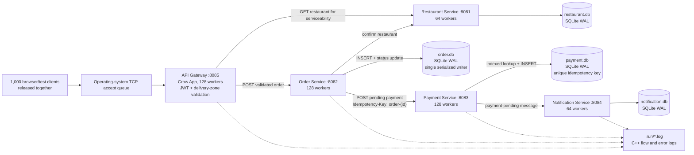
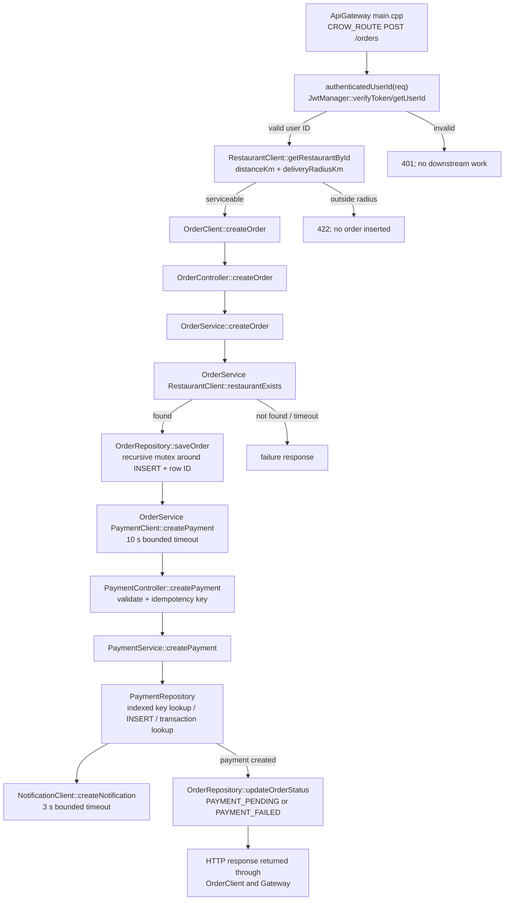
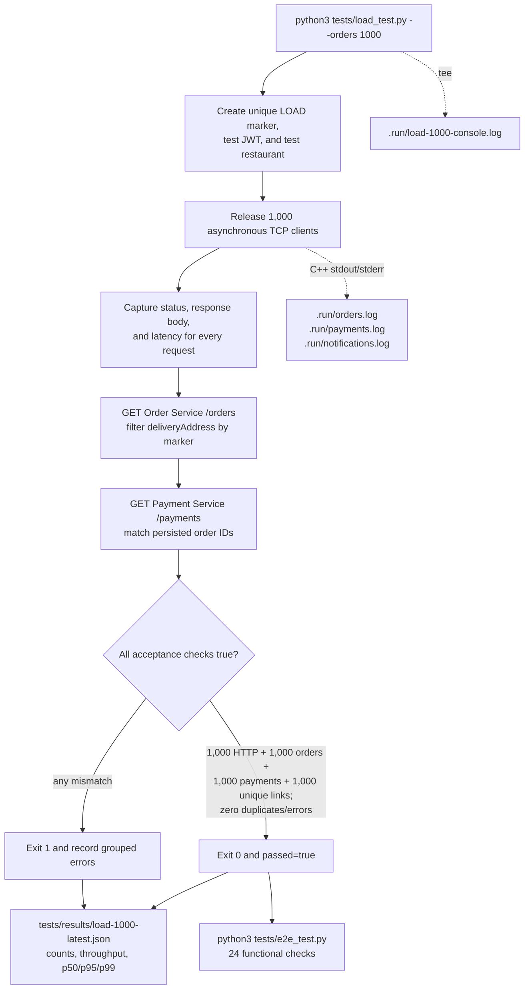
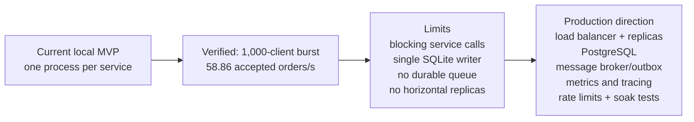

# High-concurrency order processing diagrams

These diagrams describe the current implementation and the verified local
1,000-client burst test. “Parallel” means clients connect together; requests
are processed by bounded Crow worker pools and may wait while downstream work
completes. It does not mean SQLite performs 1,000 writes simultaneously.

## Runtime architecture for many clients



The worker counts are deliberately higher than the 16 CPU cores because the
current handlers block while making localhost HTTP and SQLite calls. Workers
do not create extra copies of an order: one accepted request retains its own
stack and JSON body while shared repositories use SQLite's serialized
connection mode. The Order Repository additionally locks `INSERT` and
`sqlite3_last_insert_rowid()` together so another worker cannot replace the
new order ID between those calls.

## Code-level request path



Relevant implementation files:

- `services/ApiGateway/src/main.cpp`
- `services/ApiGateway/src/client/OrderClient.cpp`
- `services/OrderService/src/OrderController.cpp`
- `services/OrderService/src/OrderService.cpp`
- `services/OrderService/src/OrderRepository.cpp`
- `services/OrderService/src/client/PaymentClient.cpp`
- `services/PaymentService/src/PaymentController.cpp`
- `services/PaymentService/src/PaymentService.cpp`
- `services/PaymentService/src/PaymentRepository.cpp`
- `common/src/Database.cpp`

## Sequence for a 1,000-client burst

```mermaid
sequenceDiagram
    autonumber
    participant LT as load_test.py
    participant TCP as TCP/Crow accept handling
    participant GW as Gateway 128 workers
    participant RS as Restaurant 64 workers
    participant OS as Order 128 workers
    participant ODB as order.db
    participant PS as Payment 128 workers
    participant PDB as payment.db
    participant NS as Notification 64 workers

    LT->>LT: Register one isolated test user<br/>and one isolated test restaurant
    LT->>LT: Create 1,000 asyncio tasks
    LT->>LT: Set one Event; release all tasks together
    par Requests 1..1000
        LT->>TCP: Open TCP + POST /orders + shared JWT<br/>unique LOAD marker/address
        TCP->>GW: Assign accepted connection to an available worker
        GW->>GW: Verify JWT and validate payload
        GW->>RS: Read restaurant coordinates/radius
        RS-->>GW: Restaurant record
        GW->>OS: POST order with JWT-derived userId
        OS->>RS: Confirm restaurant exists
        RS-->>OS: HTTP 200
        OS->>ODB: Serialized INSERT; obtain correct orderId
        ODB-->>OS: orderId
        OS->>PS: POST /payments + order idempotency key
        PS->>PDB: Indexed idempotency lookup; INSERT pending payment
        PDB-->>PS: Unique payment record
        PS->>NS: Create payment-pending notification
        NS-->>PS: HTTP 201
        PS-->>OS: HTTP 201
        OS->>ODB: Set PAYMENT_PENDING
        OS-->>GW: success=true
        GW-->>LT: HTTP success
    end
    Note over GW,PS: When all workers are busy, accepted requests wait.<br/>Bounded downstream timeouts prevent indefinite worker starvation.
```

## Verification and test-log flow



The latest measured run passed all four 1,000-count checks, produced no
duplicates or errors, completed in 16.99 seconds, and was followed by 24/24
passing functional tests. See [the load-testing guide](LOAD_TESTING.md) for the
commands and limitations.

## Current scaling boundary



The measured result is evidence for this machine and test payload, not a claim
that the application can sustain 1,000 new orders every second or meet a
production availability target.

For interactive browsing, `GET /orders` is JWT-scoped at the Gateway and the
frontend limits payment-status enrichment to eight requests at a time. Load
verification intentionally reads the internal Order and Payment services
directly after the burst so it can validate all marker-tagged persistence rows.
