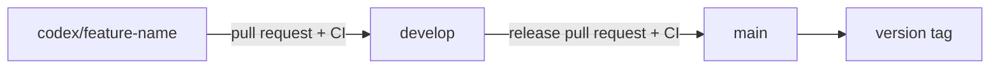
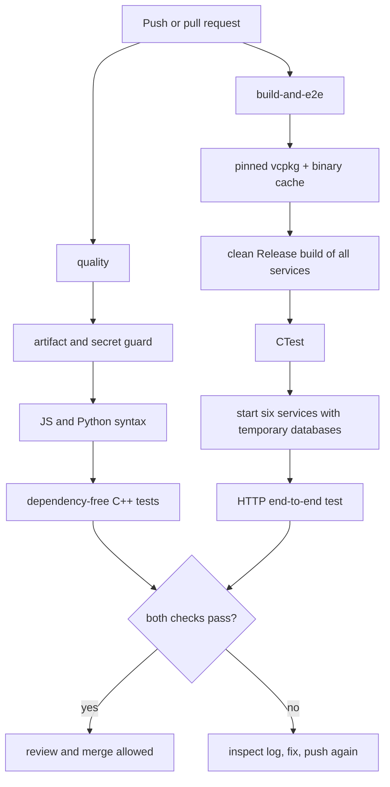

# Git toolchain and automated pipeline

This guide explains both the tools and the daily workflow used by FoodService. The pipeline is intentionally split into a fast feedback gate and a complete build/test gate.

## 1. What each tool does

| Tool | Responsibility |
|---|---|
| Git | Records local source-code history as commits. |
| GitHub | Stores the shared repository, pull requests, reviews, and protected branches. |
| GitHub Actions | Runs the same checks automatically on clean hosted machines. |
| CMake | Configures and builds all C++ services and test executables. |
| vcpkg | Installs pinned C++ dependencies from `vcpkg.json`. |
| CTest | Discovers and executes C++ tests registered by CMake. |
| Python/Node.js | Run the E2E/load tests and validate frontend JavaScript. |

Git is the version-control tool; GitHub Actions is the CI system. They solve different problems and work together.

## 2. Branch model



- `main`: stable release history. Do not develop directly here.
- `develop`: integrated next version. Normal feature pull requests target this branch.
- `codex/<short-name>`: one isolated change. Delete it after merge.
- Emergency production fixes should start from `main`, be merged to `main`, and then be merged back into `develop`.

## 3. One-time developer setup

Install Git, CMake, a C++20 compiler, Node.js, Python 3, and vcpkg. On Windows this project is most reproducible in WSL because hosted CI also uses Ubuntu.

Configure the identity written into new commits:

```powershell
git config --global user.name "Your Name"
git config --global user.email "your-github-email@example.com"
git config --global init.defaultBranch main
```

Confirm the repository and remotes:

```powershell
git status
git remote -v
git branch --show-current
```

Never store Razorpay keys, JWT production secrets, passwords, `.env` files, databases, or build output in Git. The pipeline rejects newly added generated and secret-shaped files. GitHub Actions uses dummy, test-only values for its isolated E2E run. This repository has historical tracked `build/` artifacts; removing those is separate cleanup work, not permission to add more.

## 4. Daily development workflow

Start from the newest integration branch:

```powershell
git switch develop
git pull --ff-only origin develop
git switch -c codex/short-feature-name
```

Make a small, reviewable change. Before committing, run the Windows preflight:

```powershell
.\scripts\ci-local.ps1
```

For exact fast-CI parity, run this from WSL at the repository root:

```bash
bash scripts/ci-local.sh
```

The fast check validates whitespace, tracked artifacts/secrets, JavaScript and Python syntax, and two dependency-free C++ policy tests. To reproduce the complete build job after bootstrapping vcpkg:

```bash
export VCPKG_ROOT="$HOME/vcpkg"
bash scripts/ci-local.sh --full
```

Review and commit only intended files:

```powershell
git status --short
git diff
git add path\to\changed-file path\to\test-file
git diff --cached
git commit -m "Add concise description"
git push -u origin codex/short-feature-name
```

Open a pull request from `codex/short-feature-name` to `develop`. Complete the pull-request checklist, wait for both checks, address review comments, and merge. Product releases use a second pull request from `develop` to `main`.

## 5. What the automated workflow runs

The workflow is `.github/workflows/ci.yml`. It runs for pull requests and pushes involving `develop` or `main`, and it can be started manually from the Actions page.



The required check names are:

- `quality`: normally finishes quickly and catches inexpensive problems.
- `build-and-e2e`: creates a clean dependency environment, compiles every service, runs CTest, then exercises the live HTTP service chain.

Concurrent runs on the same branch are grouped; when a newer commit arrives, the obsolete run is cancelled. The dependency cache speeds up repeated builds but never replaces tests. E2E services write databases and logs only inside a temporary directory that is removed afterward.

## 6. Turn CI checks into merge protection

The workflow file creates checks, but repository rules make them mandatory. An administrator should do the following after the workflow has run successfully at least once:

1. Open GitHub repository **Settings → Rules → Rulesets** (or **Branches**, depending on the UI).
2. Create a branch ruleset for `develop`.
3. Require a pull request before merging.
4. Require status checks `quality` and `build-and-e2e`.
5. Require the branch to be up to date before merging.
6. Require at least one approval when another reviewer is available.
7. Block force pushes and branch deletion.
8. Apply the same protections to `main`; use only reviewed `develop → main` release pull requests.
9. Keep administrator bypass narrowly restricted for emergencies.

Status-check names usually become selectable only after the workflow has run once. A workflow without branch protection reports failures but cannot itself prevent a merge.

## 7. Where to see test results and logs

On GitHub, open **Actions → FoodService CI → the latest run**. Select `quality` or `build-and-e2e`, then select the failing step. Every command and its output is recorded there.

On a pull request, the checks appear near the bottom under merge status. Select **Details** beside a check to open the same logs.

Common failures:

| Failure | Meaning and response |
|---|---|
| Generated/secret file is tracked | Remove it from Git tracking, add an ignore rule if needed, and rotate any real exposed secret. |
| JavaScript/Python syntax | Run the named checker locally and fix the reported file/line. |
| CMake or compiler failure | Read the first compiler error, reproduce with `ci-local.sh --full`, and fix code or manifest. |
| CTest failure | Run `ctest --test-dir build-ci --output-on-failure`. |
| Service health timeout | Inspect the service logs printed by `ci-e2e.sh`; usually a port, startup, or configuration failure. |
| E2E assertion failure | The services started, but the observed API behavior did not match the contract. |

Do not repeatedly restart a failed job without a reason: a deterministic code failure needs a new corrective commit.

## 8. Release and rollback discipline

After a release pull request reaches `main`, create an immutable version tag when appropriate:

```powershell
git switch main
git pull --ff-only origin main
git tag -a v0.1.0 -m "FoodService v0.1.0"
git push origin v0.1.0
```

A tag identifies a known source revision; it is not deployment by itself. Roll back by redeploying a previously verified tag or by creating a normal revert commit and pull request. Avoid rewriting shared branch history.

## 9. Current limits

This is a continuous-integration pipeline, not yet a production deployment pipeline. It proves that a clean hosted runner can build and test the repository. A later CD stage should use environments, approvals, an image registry, vulnerability scanning, deployment health checks, and rollback automation. Real payment credentials belong in an environment-scoped secret manager and must never be used by pull-request CI.
