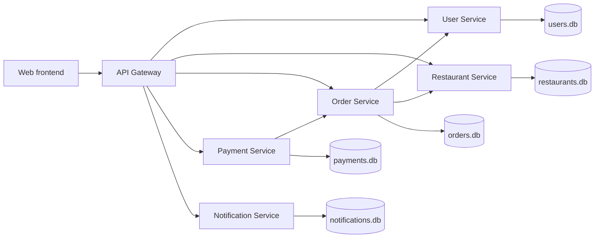
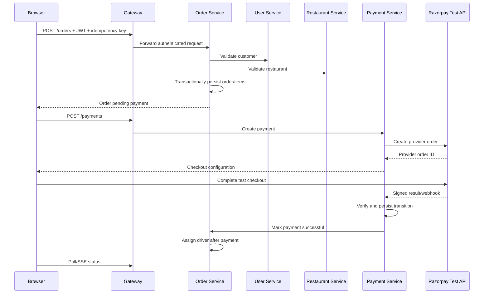
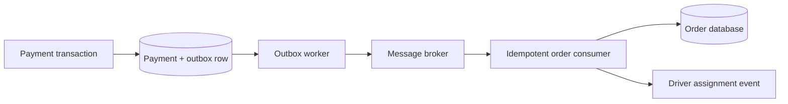

# FoodService Interview Guide

This guide explains the repository for backend and system-design interviews at
companies such as Meta and Google. It distinguishes implemented behavior from
production improvements.

## Thirty-second summary

FoodService is a C++20 microservice ordering system with a browser frontend. An
API Gateway routes requests to user, restaurant, order, payment, and notification
services. The implementation uses Crow HTTP servers, SQLite, JWT authentication,
idempotent order/payment creation, Razorpay test mode, and browser GPS tracking.

It is a strong local demonstration, not yet a production Zomato clone. Services
use local SQLite databases and mostly synchronous HTTP calls; production would
need replicated databases, durable messaging, stronger observability, and
automated orchestration.

## Microservice architecture



| Service | Responsibility | Why separate it? |
|---|---|---|
| Gateway | Public routes and service proxying | Hides topology; one client entry point |
| User | Accounts, password hashes, JWTs | Isolates identity and credentials |
| Restaurant | Catalogue and nearby queries | Read traffic scales independently |
| Order | Cart/order lifecycle and delivery state | Owns order invariants |
| Payment | Razorpay, webhooks, idempotency | Isolates secrets and financial state |
| Notification | Notification records | Delivery channels can evolve separately |

The common code path is:

```text
HTTP route/controller -> service/business logic -> repository -> SQLite
```

Each service owns its data. Other services communicate through APIs instead of
reading its tables. This reduces schema coupling but introduces network failure
and eventual-consistency problems.

## End-to-end order and payment flow



A driver must be assigned only after verified payment success. A browser success
message is not authoritative; the backend verifies the provider result.

## CRUD operations

CRUD means Create, Read, Update, and Delete.

| Resource | Create | Read | Update | Delete |
|---|---|---|---|---|
| Users | register | list/profile | profile fields | account/admin delete |
| Restaurants | add restaurant | list/get/nearby | catalogue fields | remove restaurant |
| Orders | create cart/order | get/customer history | status/location | cancel/delete when allowed |
| Payments | create intent | by ID/order | verified state transition | retained for audit |
| Notifications | service-generated | list/read | read state | cleanup where supported |

Important repository practices:

- validate JSON before persistence;
- bind SQL parameters instead of concatenating input;
- derive customer identity from the verified JWT;
- filter reads and mutations by the authorized owner;
- use transactions for atomic multi-row writes;
- use unique idempotency keys for safe retries;
- return meaningful 2xx, 4xx, and 5xx status codes.

Order creation validates identity and references, inserts the order and item rows
inside a transaction, commits, and returns the persisted result. Retrying the
same business request with the same idempotency key returns the previous result
instead of duplicating the order.

## Multithreading and concurrency

Crow processes independent requests using worker threads. Busy services use
larger worker pools so multiple clients can make progress concurrently. Worker
count is not a capacity guarantee: synchronous downstream calls, CPU, SQLite
locks, disk I/O, sockets, and payment latency remain constraints.

### Concepts demonstrated

- **Worker pool:** a bounded group of threads handles many client requests.
- **Mutex:** protects shared state or a compound database critical section.
- **RAII lock:** releases the lock automatically on every scope exit.
- **Transaction:** atomically commits related database changes.
- **WAL:** improves overlap between SQLite readers and a writer.
- **Busy timeout:** waits for a database lock rather than instantly failing.
- **Idempotency:** protects a business operation from duplicate retries.
- **Backpressure:** bounds admitted/queued work instead of allowing overload.

A concrete race exists when threads share an SQLite connection: thread A inserts,
thread B inserts, and then A calls `last_insert_rowid()`. A could receive B's ID.
The insert and ID lookup must be one protected critical section/transaction.

| Risk | Example | Mitigation |
|---|---|---|
| Race | interleaved insert and last-ID lookup | mutex and transaction |
| Duplicate effect | retry after client timeout | unique idempotency key |
| Database busy | concurrent SQLite writers | short transactions, WAL, timeout |
| Starvation | workers block on slow HTTP | deadlines, async I/O, circuit breaker |
| Deadlock | inconsistent lock order | small critical sections, fixed ordering |
| Overload | arrivals exceed throughput | rate limit, bounded queue, 429/503 |

### Interpreting the 1,000-client test

The load test can prove that a particular machine and configuration completed a
1,000-client burst. It does not prove unlimited sustained production capacity.
A credible result reports concurrency, request count, throughput, p50/p95/p99
latency, errors, CPU, memory, thread usage, lock waits, hardware, and dependency
configuration.

## Distributed consistency

A transaction cannot atomically commit SQLite data in two services. Payment can
succeed while Order Service is temporarily unavailable. Production should use a
transactional outbox:



Store payment success and the outbox event in one local transaction. Publish it
with retries. The consumer applies it idempotently. This provides eventual
consistency. “Exactly once” across a network is generally replaced by at-least-
once delivery plus deduplication and unique business keys.

Also add timeouts, exponential backoff with jitter, circuit breakers, dead-letter
queues, reconciliation jobs, correlation IDs, structured logs, metrics, and
distributed tracing.

## Live driver GPS

The driver page reads the driver's browser Geolocation API and sends coordinates,
accuracy, driver details, status, order ID, and a driver-only token. The customer
reads authorized snapshots and moves the bike marker from the latest coordinates.

Production controls include HTTPS, a short-lived token scoped to one driver/order,
payment and assignment checks, update-rate limits, payload validation, timestamp
or sequence-number ordering, stale-location detection, and minimal retention.
At scale, stream updates through a broker, keep the latest point in a low-latency
geospatial store, sample history asynchronously, and fan out through WebSockets
or SSE.

## Production scaling plan

1. Run stateless replicas behind load balancers.
2. Replace per-process SQLite with managed PostgreSQL/MySQL and connection pools.
3. Add Redis for cache, rate limiting, and short-lived/idempotency data.
4. Move state propagation and notifications to a durable message broker.
5. Add deadlines, circuit breakers, bulkheads, bounded queues, and edge limits.
6. Instrument OpenTelemetry traces, centralized logs, metrics, and SLO alerts.
7. Autoscale on latency, queue depth, CPU, and error rate.
8. Deploy across zones with backups, migrations, and disaster-recovery drills.

## Meta/Google-style questions and answers

**1. Why microservices?**
The domains have different security, ownership, and scale profiles. The cost is
network failure and operational complexity. For a small team, a modular monolith
would be a reasonable starting point and could preserve the same boundaries.

**2. Why an API Gateway?**
It creates one public endpoint, hides topology, and centralizes routing, CORS,
rate limits, request IDs, and policy. Business logic should remain in services.

**3. Why database-per-service?**
It prevents schema coupling and permits independent evolution. Cross-service
joins become API composition, events, or materialized read models.

**4. How is POST made safe to retry?**
Store a caller-scoped idempotency key under a uniqueness constraint together with
the result. A repeat returns the original result.

**5. PUT versus PATCH?**
PUT generally replaces a representation and is idempotent; PATCH changes selected
fields. Both need validation, authorization, and concurrency policy.

**6. How do you prevent cross-user order access?**
Derive identity from a verified JWT and include it in every query/mutation
predicate. Never trust a customer ID supplied by the browser.

**7. Why not delete payment records?**
Payments require audit, reconciliation, dispute, and compliance history. Prefer
state transitions and retention policies over hard deletion.

**8. Mutex versus transaction?**
A mutex coordinates application threads and shared memory/connection use. A
database transaction provides atomicity, isolation, and durability for data.

**9. Why not create thousands of threads?**
Threads consume memory and scheduling time, while blocking dependencies remain
bottlenecks. Use bounded pools, async I/O where valuable, and backpressure.

**10. What does WAL solve?**
It allows readers to continue during an appended write. SQLite still has a
single-writer constraint and is not a distributed production database.

**11. Payment succeeded but order update failed—what now?**
Persist payment plus an outbox event atomically, retry publishing, apply an
idempotent order transition, and use reconciliation against the provider.

**12. How do you verify webhooks?**
Verify the signature over raw bytes with the secret, reject replay/stale events,
store provider event IDs uniquely, and enforce valid state transitions.

**13. How do you prevent two driver assignments?**
Use a conditional atomic update where the driver is null and payment succeeded,
then check affected rows and enforce a unique active assignment constraint.

**14. Which consistency model suits GPS?**
Eventual consistency is acceptable. Include timestamps/sequence numbers and
ignore older updates so the displayed position does not move backward.

**15. Can this handle 1,000 simultaneous orders?**
Only a measured test on a named configuration supports that statement. Quote
throughput, tail latency, errors, and resource saturation—not worker count alone.

**16. How do you find the bottleneck?**
Trace requests and split queue, application, SQL, lock, and downstream time;
correlate them with CPU, memory, threads, sockets, and errors.

**17. What should be cached?**
Restaurant catalogue and nearby results tolerate bounded staleness. Payment and
mutable order truth should not be served from an unsafe stale cache.

**18. How do you prevent retry storms?**
Use deadlines, exponential backoff with jitter, retry budgets, circuit breakers,
and `Retry-After`. Retry only idempotent/protected operations.

**19. What SLOs matter?**
Order-creation availability and tail latency, payment reconciliation delay, and
driver-location freshness—user journeys rather than only process uptime.

**20. How are passwords stored?**
Use Argon2id or bcrypt with unique salts. Never store plaintext or reversible
passwords. Secrets belong in a secrets manager, not source or frontend code.

**21. How do you test negative scenarios?**
Test expired JWTs, wrong owners, invalid input, duplicate keys, DB locks, provider
timeouts, bad/replayed/out-of-order webhooks, downstream outage, stale GPS, and
cancelled/delivered state violations.

**22. What is the testing pyramid?**
Unit-test validation/transitions/pricing, integration-test repositories and APIs,
contract-test service compatibility, E2E-test the customer journey, then run load
and fault-injection tests.

## Interview answer structure

1. Clarify users, geography, traffic, and correctness requirements.
2. Estimate peak reads/writes, storage, and GPS volume.
3. Define APIs and data models.
4. Draw services and the critical request path.
5. Deep-dive into idempotency, payment, state transitions, and tracking.
6. Address partitioning, cache, events, backpressure, and failures.
7. Cover security, observability, availability, and disaster recovery.
8. State trade-offs and a practical phased implementation.

The strongest answer separates **what exists**, **what a test proves**, and **what
production requires**.

## Related documentation

- [Architecture](ARCHITECTURE.md)
- [API reference](API.md)
- [Codebase guide](CODEBASE_GUIDE.md)
- [Concurrency diagrams](CONCURRENCY_DIAGRAMS.md)
- [Testing](TESTING.md)
- [Load testing](LOAD_TESTING.md)
- [Product requirements](PRODUCT_REQUIREMENTS.md)
