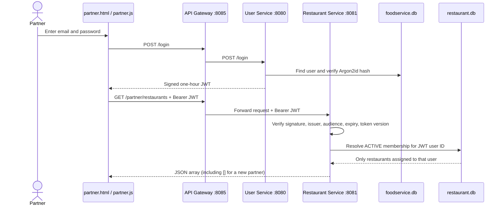

# Restaurant Partner Backend — Implementation and Launch Readiness

Updated: 2026-09-01
Implementation branch: `develop`

## What is stored where

Restaurant login is not stored in the browser and is not duplicated in the
restaurant database.

| Data | Owner | Local development store | Reason |
| --- | --- | --- | --- |
| Name, email, Argon2id password hash | User Service | `foodservice.db` | One identity can be a customer and a restaurant partner. |
| Signed session identity | User Service | One-hour JWT issued after login | The JWT carries the user ID; it does not grant ownership by itself. |
| Restaurant profile and onboarding state | Restaurant Service | `restaurant.db`, `restaurants` | Restaurant Service is the only owner of restaurant state. |
| User-to-restaurant role | Restaurant Service | `restaurant_partners` | Links the JWT user ID to one restaurant as OWNER, MANAGER, or STAFF. |
| Menu items and versions | Restaurant Service | `partner_menu_items` | Keeps menu authorization and data in one service boundary. |
| Partner activity history | Restaurant Service | `partner_audit_events` | Records actor, action, resource, result, correlation ID, and time. |
| Selected restaurant in the UI | Browser session storage | Restaurant ID only | Presentation convenience; never used as authorization. |

SQLite is suitable for local development and automated tests. A real launch
must move these schemas through versioned migrations to a managed relational
database with encrypted disks, backups, restore drills, monitoring, and a
retention policy.

## Implemented request flow

The gateway is the only browser-facing backend. Port 8081 remains a private
service port in deployment. Restaurant Service verifies the JWT again, so a
gateway routing mistake does not automatically bypass restaurant ownership.

## Restaurant and menu lifecycle

1. Any authenticated FoodService identity may create a private restaurant
   onboarding application.
2. Creation atomically writes the restaurant, an ACTIVE OWNER membership, and
   a `RESTAURANT_CREATED` audit event.
3. DRAFT and REJECTED records may be edited by an authorized role.
4. Menu items use integer paise and optimistic `version` values.
5. Submission requires at least one menu item and changes the restaurant to
   `PENDING_REVIEW`.
6. DRAFT, REJECTED, and PENDING_REVIEW restaurants are excluded from customer
   `GET /restaurants` and `GET /restaurants/{id}`.
7. Partner routes cannot set `APPROVED` or approve themselves. A separate admin
   authorization boundary is intentionally still required.

Every implemented write and its success audit event share one SQL transaction.
If either fails, both roll back. A stale restaurant/menu version returns HTTP
409 instead of silently overwriting another editor's work.

## Implemented API surface

All routes below require `Authorization: Bearer <JWT>` and are exposed through
API Gateway.

| Method and path | Purpose |
| --- | --- |
| `GET /partner/restaurants` | List only restaurants with an ACTIVE membership for this user. |
| `POST /partner/restaurants` | Create a private DRAFT and OWNER membership. |
| `GET /partner/restaurants/{id}` | Read one authorized restaurant. |
| `PUT /partner/restaurants/{id}` | Update a complete DRAFT/REJECTED profile with expected version. |
| `POST /partner/restaurants/{id}/submit` | Validate menu and move to PENDING_REVIEW. |
| `GET /partner/restaurants/{id}/menu-items` | List authorized menu items; returns `[]` when empty. |
| `POST /partner/restaurants/{id}/menu-items` | Add an item with integer `pricePaise`. |
| `PUT /partner/restaurants/{id}/menu-items/{itemId}` | Update an item using optimistic version. |
| `DELETE /partner/restaurants/{id}/menu-items/{itemId}` | Remove an item from an editable restaurant. |
| `GET /partner/restaurants/{id}/audit` | Return the latest 50 authorized server audit events. |

Legacy public restaurant mutation methods are no longer exposed by API Gateway;
customer `/restaurants` routes are read-only. In production, network policy
must also prevent clients from reaching Restaurant Service directly.

## Security controls implemented

- Passwords are salted Argon2id hashes; passwords and JWTs are not logged.
- JWT verification checks signature, issuer, audience, expiry, and token version.
- Production startup requires `FOODSERVICE_JWT_SECRET` with at least 32
  characters; the fallback is explicitly local-development only.
- `FOODSERVICE_ALLOWED_ORIGIN` replaces wildcard CORS at the gateway.
- Restaurant ID is resolved together with ACTIVE membership on every resource
  operation; another user receives 404 and cannot enumerate ownership.
- OWNER/MANAGER/STAFF permissions are centralized in `PartnerAccessPolicy.h`.
- Parameterized SQLite statements and server-side field limits are used.
- Customer reads include only APPROVED restaurants.
- Partner data is output-escaped in the browser.
- Successful changes and audit records commit atomically with correlation IDs.

## Important launch blockers

This is a real frontend/backend implementation, not a browser-only mock, but it
is not yet safe to call a launched marketplace.

| Blocker | Why it remains |
| --- | --- |
| Email ownership verification and account recovery | Syntax validation is not proof that the user owns the mailbox. |
| Admin review/approval/suspension portal | Separation of duties exists in policy, but the independent admin API/UI is not implemented. |
| KYC/FSSAI/GST and document handling | Requires legal rules, malware scanning, encrypted object storage, retention, and a verification provider. |
| Team invitations and revocation | Requires verified email, expiring single-use invitations, last-owner protection, and session revocation. |
| Authoritative categories/variants/add-ons/tax/stock | Current menu supports the secure item foundation only. |
| Restaurant order operations | Paid, restaurant-scoped order projection and accept/prepare/ready transitions remain. |
| Rate limiting and abuse controls | Gateway has no account/IP/restaurant limiter yet. |
| Durable idempotency and outbox | Frontend sends keys for retryable commands, but partner command deduplication and event delivery are not yet persisted. |
| Managed database operations | SQLite startup schema changes are not production migrations or high-availability storage. |
| CSP/security headers, penetration and accessibility audits | Required before an external pilot. |

## Code map

| Responsibility | Source |
| --- | --- |
| Partner UI and gateway calls | `frontend/partner.html`, `frontend/partner.js`, `frontend/partner.css` |
| Gateway routes and public-write removal | `services/ApiGateway/src/main.cpp` |
| Gateway Restaurant client | `services/ApiGateway/include/client/RestaurantClient.h`, `services/ApiGateway/src/client/RestaurantClient.cpp` |
| Partner HTTP validation and JWT boundary | `services/RestaurantService/include/PartnerController.h`, `services/RestaurantService/src/PartnerController.cpp` |
| Membership/menu/audit transactions | `services/RestaurantService/include/PartnerRepository.h`, `services/RestaurantService/src/PartnerRepository.cpp` |
| Role/transition policy | `common/include/PartnerAccessPolicy.h` |
| JWT creation and verification | `common/src/JwtManager.cpp` |
| Customer visibility filter | `services/RestaurantService/src/RestaurantRepository.cpp` |
| Repository isolation tests | `tests/partner_repository_test.cpp` |
| Policy tests | `tests/partner_access_policy_test.cpp` |
| Frontend contracts | `tests/portal_contract_test.py` |
| Live gateway test | `tests/partner_api_e2e_test.py` |

## Verified evidence

On 2026-09-01:

- clean WSL CMake build completed for all services;
- CTest: 7/7 passed;
- portal contracts: 3/3 passed;
- live gateway test used two new identities and verified an empty `[]` first
  response, owner count 1, other-user count 0, cross-tenant HTTP 404, empty menu
  `[]`, customer visibility 0 before and after submission, final status
  PENDING_REVIEW, and three audit events.

The integration test creates local `.test` accounts and a private test
restaurant. Run it only against disposable development/test databases.
