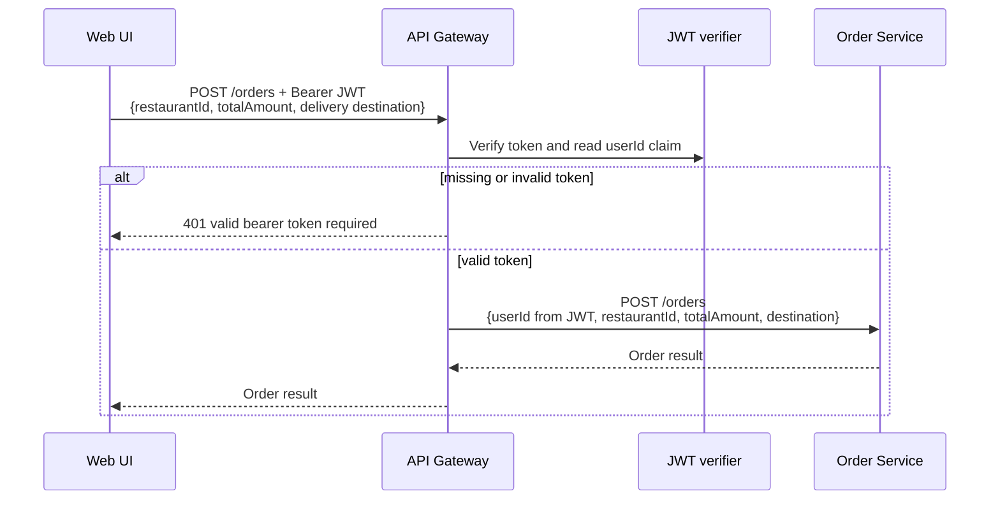
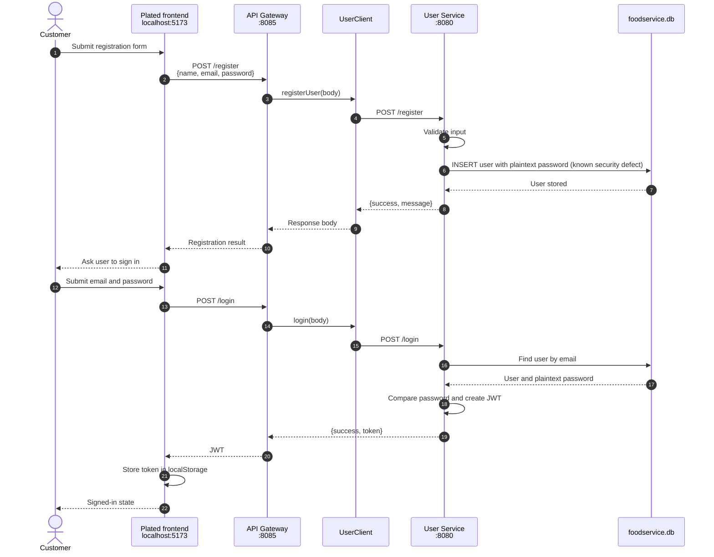
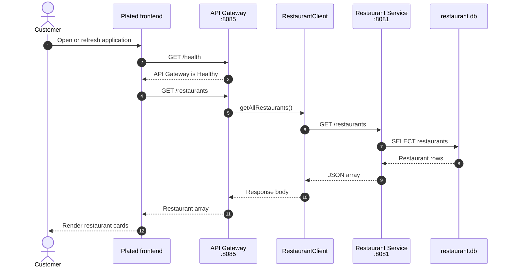
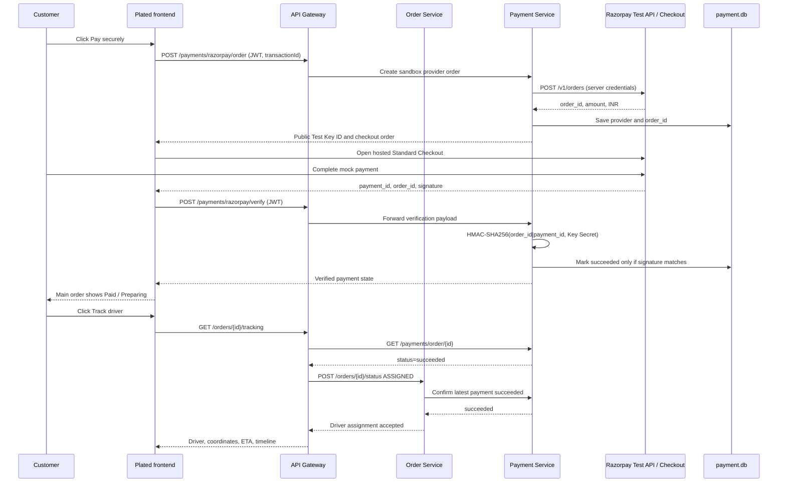
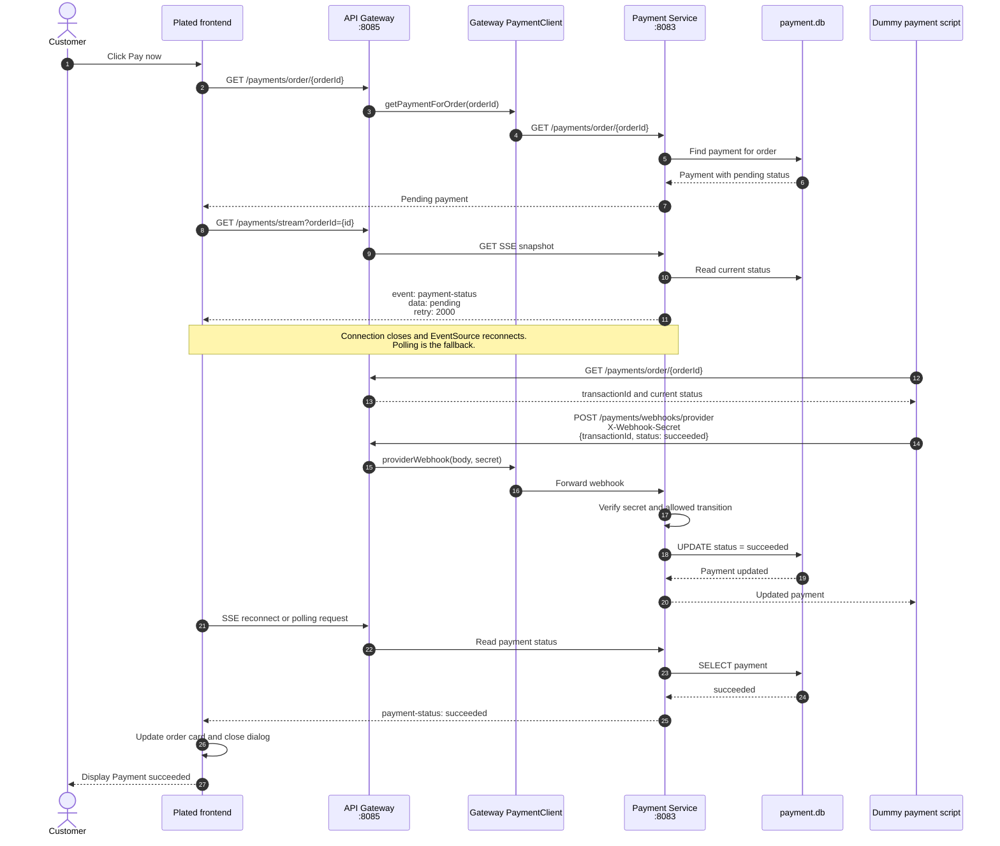
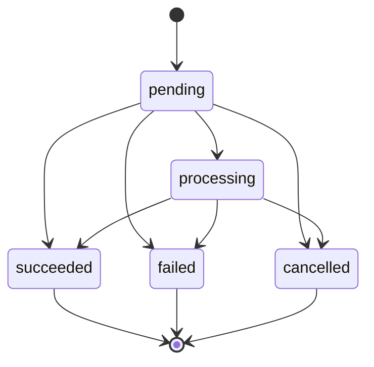
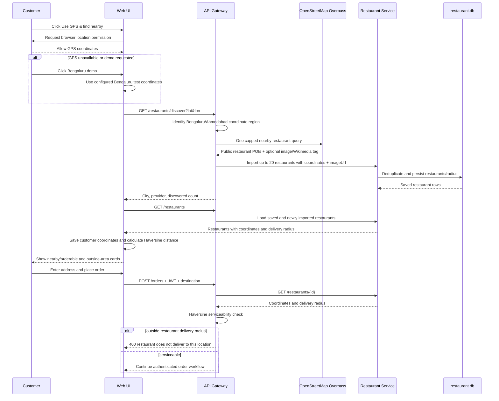
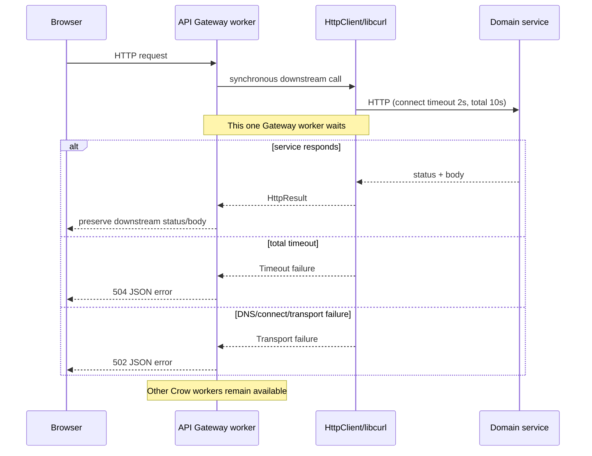
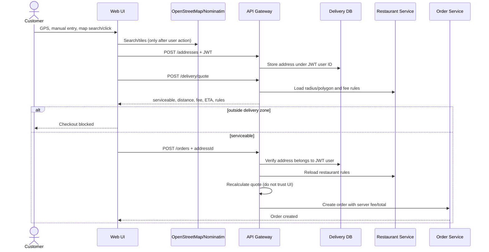

# End-to-end sequence diagrams

These diagrams describe how the browser frontend, API Gateway, C++
microservices, and SQLite databases communicate in the current implementation.

The multi-client worker, code-path, 1,000-order, and test-verification diagrams
are maintained in [High-concurrency order processing](CONCURRENCY_DIAGRAMS.md).

## Authenticated customer identity



The gateway is the public identity trust boundary. It ignores any client-sent
`userId` for order and payment creation and injects the verified JWT claim.

## Components and ports

| Component | Port | Storage |
|---|---:|---|
| Plated frontend | 5173 | Browser local storage for API URL, JWT, selected location, and address |
| API Gateway | 8085 | None |
| User Service | 8080 | `foodservice.db` |
| Restaurant Service | 8081 | `restaurant.db` |
| Order Service | 8082 | `order.db` |
| Payment Service | 8083 | `payment.db` |
| Notification Service | 8084 | `notification.db` |

## 1. Registration and login



Protected user requests include `Authorization: Bearer <JWT>`. The API Gateway
forwards this header to User Service, where authentication middleware validates
it.

Passwords are not currently hashed despite the intended production design.
Only dummy local credentials may be used until the documented security debt is
fixed.

## 2. Load restaurants



## 3. Create order and pending payment

An order creates its payment intent automatically. The frontend reuses that
payment instead of creating a duplicate.

```mermaid
sequenceDiagram
    autonumber
    actor Customer
    participant UI as Plated frontend
    participant GW as API Gateway<br/>:8085
    participant OC as Gateway OrderClient
    participant OS as Order Service<br/>:8082
    participant RS as Restaurant Service<br/>:8081
    participant ODB as order.db
    participant PS as Payment Service<br/>:8083
    participant PDB as payment.db
    participant NS as Notification Service<br/>:8084
    participant NDB as notification.db

    Customer->>UI: Click Order here
    Customer->>UI: Select menu items/quantities and optional WELCOME10
    UI->>UI: Calculate subtotal, discount, delivery fee, and total
    UI->>GW: POST /orders + JWT<br/>{restaurantId, item summary, price breakdown, destination}
    GW->>GW: Verify JWT; inject userId; validate delivery radius
    GW->>OC: createOrder(body)
    OC->>OS: POST /orders
    OS->>RS: GET /restaurants/{restaurantId}
    RS-->>OS: Restaurant exists
    OS->>ODB: INSERT order with PENDING
    ODB-->>OS: New order ID
    OS->>PS: POST /payments<br/>Idempotency-Key: order-{id}
    PS->>PDB: Find payment by idempotency key
    PDB-->>PS: No existing payment
    PS->>PDB: INSERT test payment with pending status
    PDB-->>PS: Payment stored
    PS->>NS: POST /notifications<br/>Payment pending
    NS->>NDB: INSERT notification
    NDB-->>NS: Notification stored
    NS-->>PS: Created
    PS-->>OS: HTTP 201 payment created
    OS->>ODB: UPDATE order status = PAYMENT_PENDING
    OS-->>OC: Order created response
    OC-->>GW: Response body
    GW-->>UI: {success, message}
    UI->>GW: GET /orders + JWT
    GW->>GW: Filter rows to JWT customer ID
    GW-->>UI: Signed-in customer's order array
    UI->>GW: GET /payments/order/{orderId}
    GW-->>UI: Pending payment
    UI-->>Customer: Render order with pending status
```

The frontend performs payment lookups with a bounded pool of eight requests,
so even a large customer history cannot monopolize the browser connection queue
and block a new order submission.

If the restaurant does not exist, the order is rejected. If payment creation
fails—for example, an amount above `1000000`—Order Service records
`PAYMENT_FAILED` and no payable transaction exists.

## 4. Dummy provider payment and live UI status

### Razorpay Test Mode checkout



Test Mode moves no real funds. The browser receives only the public Test Key
ID; the Key Secret remains inside Payment Service.

If either payment check is not `succeeded`, tracking returns HTTP 409 and Order
Service rejects the delivery transition. The tracking timer is not created.

`scripts/test-dummy-payment.ps1` simulates the external provider. It looks up
the payment transaction and sends an authenticated webhook.



Allowed provider transitions:



## 5. Payment-to-order consistency boundary

After an authenticated provider callback is accepted, Payment Service persists
the payment transition and synchronously calls the authenticated internal Order
Service payment-status endpoint.

```mermaid
sequenceDiagram
    participant Provider as Dummy/real provider
    participant PS as Payment Service
    participant PDB as payment.db
    participant OS as Order Service
    participant ODB as order.db

    Provider->>PS: Webhook: succeeded
    PS->>PDB: Idempotently set Payment = succeeded
    PDB-->>PS: Durable payment state
    PS->>OS: POST /orders/{id}/payment-status<br/>X-Internal-Secret<br/>{paymentStatus: succeeded}
    OS->>OS: Validate secret and transition policy
    OS->>ODB: PAYMENT_PENDING -> CONFIRMED
    ODB-->>OS: Order updated
    OS-->>PS: HTTP 200 synchronized
    PS-->>Provider: HTTP 200 payment + order consistent

    alt Order Service unavailable
        PS-->>Provider: HTTP 502 payment stored; retry safely
        Note over PS,OS: Duplicate callback re-attempts order synchronization
    end
```

The same endpoint maps `processing -> PAYMENT_PENDING`,
`failed -> PAYMENT_FAILED`, and `cancelled -> CANCELLED`. Duplicate events are
accepted without regressing `CONFIRMED` or delivery states. This local synchronous
callback exposes failures but cannot guarantee delivery after a process crash.
Production still requires a transactional outbox, durable broker, idempotent
consumer/event IDs, retries, and payment/order reconciliation.

## 6. Fetch nearby restaurants from the customer's location



Nearby discovery is user-triggered and displays OpenStreetMap attribution. The
public endpoint is a development dependency only; production must use a
contracted or self-hosted provider with caching, monitoring, and privacy review.

## 7. Real driver GPS tracking

```mermaid
sequenceDiagram
    participant Driver
    participant DriverUI as Driver browser portal
    participant Customer
    participant UI as Web UI
    participant GW as API Gateway
    participant JWT as JWT verifier
    participant PS as Payment Service
    participant OS as Order Service
    participant DDB as delivery.db
    participant ODB as order.db

    Driver->>DriverUI: Enter paid order and driver token; allow GPS
    DriverUI->>DriverUI: navigator.geolocation.watchPosition
    loop Every five seconds
        DriverUI->>GW: POST driver location + token + actual GPS fix
        GW->>PS: Verify payment succeeded
        PS-->>GW: succeeded
        GW->>DDB: UPSERT coordinates, accuracy, speed, status, timestamp
        GW->>OS: Persist submitted delivery status
        GW-->>DriverUI: HTTP 202 GPS accepted
    end
    Customer->>UI: Track driver
    loop Every five seconds while tracking is open
        UI->>GW: GET /orders/{id}/tracking + JWT
        GW->>JWT: Verify token and derive customer ID
        GW->>OS: GET /orders/{id}
        OS->>ODB: Load order and destination coordinates
        ODB-->>OS: Order record
        OS-->>GW: Order details
        GW->>DDB: Read latest actual driver fix
        alt no driver fix exists
            GW-->>UI: 409 waiting for driver GPS
        else stored fix exists
            GW->>GW: Calculate age, distance progress and ETA
            GW-->>UI: Actual coordinates, accuracy, freshness, ETA, timeline
            UI->>UI: Move marker using measured progress
        end
    end
    DriverUI->>GW: Final customer coordinates + DELIVERED
    GW->>ODB: Persist DELIVERED
    GW-->>UI: 100% progress, ETA 0
```

Coordinates now come from real browser GPS movement and remain durable across
Gateway restarts. The local shared driver token is not production identity or
dispatch. Production still requires driver accounts, assignment-scoped tokens,
background mobile tracking, HTTPS, retention/deletion enforcement, and a
selected maps/routing provider for road-aware ETA.

## Bounded synchronous Gateway call



This prevents an unavailable dependency from holding a Gateway worker forever.
It does not yet provide asynchronous I/O, retries, circuit breaking, or a
request correlation ID.

## Source-code map

- Browser orchestration: `frontend/app.js`
- API Gateway routes: `services/ApiGateway/src/main.cpp`
- Gateway HTTP clients: `services/ApiGateway/src/client/`
- Order workflow: `services/OrderService/src/OrderService.cpp`
- Order-to-payment request: `services/OrderService/src/client/PaymentClient.cpp`
- Payment validation and webhooks: `services/PaymentService/src/PaymentController.cpp`
- Payment transition rules: `services/PaymentService/src/PaymentService.cpp`
- Payment persistence: `services/PaymentService/src/PaymentRepository.cpp`
- Database schema creation: `common/src/Database.cpp`
- Automated end-to-end flow: `tests/e2e_test.py`
- Parallel load and persistence verification: `tests/load_test.py`
- Manual payment simulator: `scripts/test-dummy-payment.ps1`
# Address selection and protected checkout


