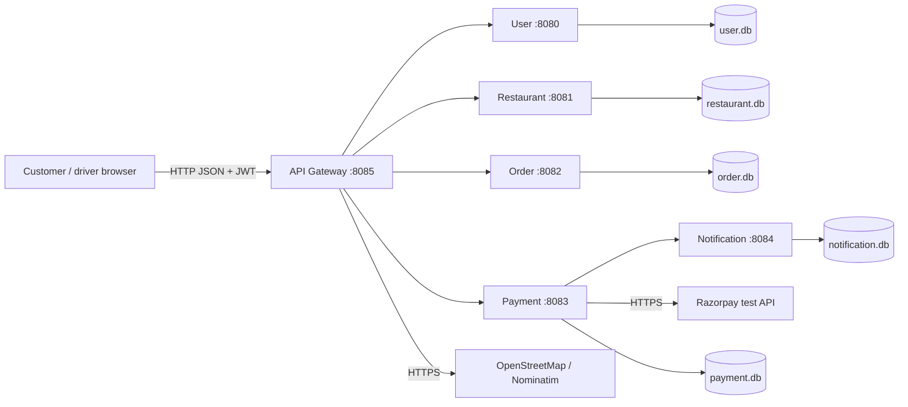
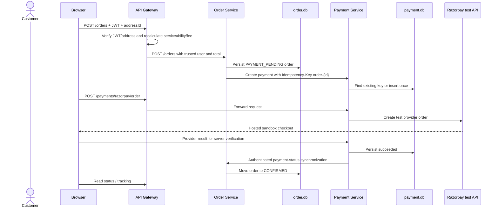

# FoodService: 30 System-Design Concepts Explained with Code

This guide maps every concept in the supplied system-design image to the current
FoodService repository. It is intentionally honest: **implemented** means code
runs today, **partial** means only part of the production concept exists, and
**not implemented** means it is a design option rather than current behavior.

## 1. Architecture at a glance



The main request path is:

```text
Browser -> API Gateway -> domain service -> Controller -> Service -> Repository -> SQLite
```

## 2. Status summary

| Status | Concepts |
|---|---|
| ✅ Implemented | Client-server, reverse proxy behavior, APIs, REST, databases, SQL, vertical scaling, indexing, vertical partitioning, denormalization, webhooks, microservices, API Gateway, idempotency |
| 🟡 Partial | IP addressing, latency controls, HTTP/HTTPS, horizontal-scaling readiness, caching, CAP trade-off, WebSocket-like realtime requirement |
| ⬜ Not implemented | Internal DNS/service discovery, GraphQL, load balancer, replication, sharding, blob storage, CDN, message queue, rate limiting |

## 3. Concepts 1–10: network, communication, and storage

### 1. Client-server architecture — ✅ implemented

**Simple meaning:** a client asks for work; a server validates the request,
performs the work, and sends a response.

**Why FoodService uses it:** the browser must not connect directly to SQLite or
possess payment secrets. It sends JSON requests to a trusted backend.

**Where and how:** `frontend/app.js::request()` sends `fetch()` calls to the
Gateway. `services/ApiGateway/src/main.cpp` receives them using Crow routes.

```javascript
// frontend/app.js (shortened)
response = await fetch(config.apiUrl + path, { ...options, headers });
```

```cpp
// services/ApiGateway/src/main.cpp
CROW_ROUTE(app, "/orders").methods(crow::HTTPMethod::POST)(...);
```

**Pattern:** client-server plus API Gateway. The browser is a thin client; the
backend remains authoritative.

### 2. IP address — 🟡 partial

**Simple meaning:** an IP address identifies a machine or network interface.
A port identifies a process on that machine.

**Use here:** local URLs resolve `localhost`/`127.0.0.1` to the same laptop.
Ports distinguish Gateway `8085`, User `8080`, Restaurant `8081`, Order `8082`,
Payment `8083`, and Notification `8084`.

**Code:** each `services/*/src/main.cpp` ends with `app.port(...)`.

**Why partial:** there is no production network, private subnet, firewall,
container IP, or stable endpoint plan. See `docs/PORTS_AND_NETWORKING.md`.

### 3. DNS — ⬜ not implemented internally

**Simple meaning:** DNS converts a name such as `api.foodservice.com` into an IP.

**Current behavior:** internal clients use fixed `localhost` URLs. External DNS
is used indirectly when libcurl contacts Razorpay or OpenStreetMap.

**Why not yet:** local development has only one machine. Production needs public
DNS for the Gateway and service discovery or platform DNS for internal replicas.

**Production design:** `api.foodservice.com -> load balancer -> Gateway replicas`;
internal names such as `payment-service` resolve through Kubernetes/managed DNS.

### 4. Proxy / reverse proxy — ✅ implemented at application level

**Simple meaning:** a reverse proxy receives client requests and forwards them
to backend servers.

**Why:** the frontend should use one base URL and should not know internal ports.

**Code:** Gateway routes call wrappers under
`services/ApiGateway/src/client/`, which use `HttpClient.cpp`.

```cpp
// Gateway payment forwarding
return crow::response(paymentClient.createPayment(
    body.dump(), req.get_header_value("Idempotency-Key")));
```

**Pattern:** API Gateway / façade / application reverse proxy. It also verifies
JWTs, injects user identity, validates serviceability, and composes tracking.

**Limitation:** there is no edge proxy such as Nginx/Cloudflare for TLS,
compression, static caching, DDoS protection, or health-based balancing.

### 5. Latency — 🟡 partially handled

**Simple meaning:** elapsed time from request start to useful response.

**Why it matters:** Gateway calls add network hops. A slow Restaurant, Payment,
or provider call consumes a Crow worker and makes checkout appear stuck.

**Current controls:** libcurl clients set connect and overall timeouts. Examples:

```cpp
// PaymentService/src/client/OrderClient.cpp
curl_easy_setopt(curl, CURLOPT_CONNECTTIMEOUT_MS, 1000L);
curl_easy_setopt(curl, CURLOPT_TIMEOUT_MS, 3000L);
```

The UI turns failures into clear messages and payment status falls back to
polling.

**Why partial:** there are no latency histograms, service-level objectives,
distributed traces, retry budgets, or circuit breakers.

### 6. HTTP / HTTPS — 🟡 partial

**Simple meaning:** HTTP transports requests; HTTPS encrypts/authenticates the
connection with TLS.

**Use here:** browser-to-Gateway and local service-to-service calls use HTTP and
JSON. Calls to Razorpay/OpenStreetMap use HTTPS.

**Code:** Crow exposes HTTP routes; `ApiGateway/src/client/HttpClient.cpp` and
service clients use libcurl.

**Why partial:** internal development traffic is plaintext HTTP. Production
needs TLS termination at the edge, strict CORS, trusted certificates, and
possibly mTLS/service identity internally.

### 7. APIs — ✅ implemented

**Simple meaning:** an API defines how software components request behavior.

**Why:** domain services need stable contracts rather than direct access to one
another's implementation or tables.

**Where:** Crow routes live in each service's `src/main.cpp`; the full contract
is described in `docs/API.md`.

**Pattern:** contract-based integration. Current weakness: there is no OpenAPI
schema or automated compatibility validation.

### 8. REST API — ✅ implemented

**Simple meaning:** resources are represented by URLs and manipulated using
standard HTTP methods.

| Operation | Example |
|---|---|
| Create | `POST /restaurants`, `POST /orders` |
| Read | `GET /restaurants`, `GET /orders/{id}` |
| Update | `PUT /restaurants/{id}` |
| Delete | `DELETE /addresses/{id}` |

**Code:** service `main.cpp` route declarations and Controller methods.

**Pattern:** REST resource/controller design. Payment status is intentionally not
arbitrary CRUD: verified provider endpoints control successful transitions.

### 9. GraphQL — ⬜ not implemented

**Simple meaning:** clients query selected fields through one typed graph schema.

**Why it might help:** a future restaurant page may need restaurant, menu,
offers, reviews, and serviceability in one client-shaped response.

**Why it is absent:** REST is simpler for the current small API. There are no
GraphQL schemas or resolvers. Adding GraphQL now would add complexity without
solving the missing catalogue/data model.

### 10. Databases — ✅ implemented for local development

**Simple meaning:** databases persist data beyond a process restart.

**Use here:** each service opens SQLite through `common/src/Database.cpp`, and
repositories execute prepared SQL statements.

```cpp
Database database("payment.db");
PaymentRepository repository(database);
PaymentService service(repository);
PaymentController controller(service);
```

**Patterns:** database per service, repository pattern, constructor dependency
injection, RAII connection ownership.

**Limitation:** SQLite is excellent for the local MVP but is a single-node,
single-writer bottleneck. Production needs a managed relational database,
connection pooling, migrations, replicas, backup, and restore testing.

## 4. Concepts 11–20: data and scaling

### 11. SQL vs NoSQL — ✅ SQL chosen; NoSQL not used

**Meaning:** SQL databases use relations, schemas, joins, constraints, and
transactions. NoSQL includes document, key-value, column-family, and graph stores.

**Why SQL:** users, orders, payments, addresses, and restaurants are structured
records that benefit from uniqueness and transactional updates.

**Code:** `common/src/Database.cpp` creates SQLite tables and indexes; repository
classes use parameterized SQL.

**Decision:** relational storage is appropriate. A future Redis cache or event
store may complement SQL, but should not replace it without an access-pattern
reason.

### 12. Vertical scaling — ✅ used locally

**Meaning:** give one service more CPU, memory, or worker capacity.

**How:** Crow worker pools allow one process to overlap requests:

```cpp
// ApiGateway, OrderService, PaymentService
app.port(port).concurrency(128).run();
```

Restaurant and Notification use 64 workers; User uses `.multithreaded()`.
SQLite uses WAL and a busy timeout.

**Why:** this raises local concurrency without deploying more processes.

**Limit:** increasing workers cannot remove SQLite's single-writer limit and can
increase contention/memory. Worker count is not proof of 1,000-order capacity.

### 13. Horizontal scaling — 🟡 architecture-ready, not deployed

**Meaning:** run multiple copies of a service.

**Why:** restaurant reads, checkout, and payment confirmation may need separate
capacity and fault tolerance.

**What helps:** services are separate processes and use HTTP boundaries.

**What blocks it:** fixed localhost URLs, local SQLite files, no shared database,
no service discovery, no load balancer, and no orchestration manifests.

**Production change:** stateless replicas behind a load balancer, PostgreSQL,
shared/durable events, health probes, and autoscaling.

### 14. Load balancers — ⬜ not implemented

**Meaning:** distribute requests across healthy replicas.

**Why needed later:** multiple Gateways or Payment Service instances require a
single stable endpoint and health-aware traffic distribution.

**Current state:** one process per port. Crow's worker pool balances work among
threads, but that is **not** a network load balancer.

### 15. Database indexing — ✅ implemented selectively

**Meaning:** an index trades storage/write cost for faster lookup and can enforce
uniqueness.

**Code:** `common/src/Database.cpp` creates:

```sql
CREATE INDEX idx_customer_addresses_user
ON customer_addresses(user_id);

CREATE UNIQUE INDEX idx_payments_idempotency_key
ON payments(idempotency_key)
WHERE idempotency_key IS NOT NULL;

CREATE UNIQUE INDEX idx_payments_transaction_id
ON payments(transaction_id);
```

**Why:** list addresses by customer quickly and prevent duplicate payment
business operations even under concurrent requests.

**Limitation:** production needs indexes derived from measured query plans and
bounded/paginated access patterns.

### 16. Replication — ⬜ not implemented

**Meaning:** maintain copies of data for availability and read scaling.

**Current state:** each service has one SQLite file. Copying a `.db` file is a
backup technique, not live replication.

**Production design:** managed PostgreSQL primary plus standby/read replica,
automated failover, point-in-time recovery, and tested recovery objectives.

### 17. Sharding — ⬜ not implemented

**Meaning:** split rows across databases by a shard key such as city or user.

**Why not now:** sharding adds routing, rebalancing, cross-shard query, and
transaction complexity. Current scale does not justify it.

**Possible future:** partition by city/region after Phase 4 evidence, while
globally unique order IDs and cross-city administration remain supported.

### 18. Vertical partitioning — ✅ implemented by domain

**Meaning:** split a large data set by columns or business area.

**Use here:** User, Restaurant, Order, Payment, and Notification each own a
separate database and schema.

**Why:** payment secrets and lifecycle belong to Payment Service; restaurant
catalogue changes should not require Order database ownership.

**Pattern:** bounded contexts plus database per service. This prevents direct
cross-service joins and creates eventual-consistency work.

### 19. Caching — 🟡 browser-only caching

**Meaning:** save previously computed/fetched data to reduce repeated work.

**Current use:** `frontend/app.js` stores token, profile, favourites, location,
and payment UI progress in `localStorage`.

**What is not present:** no Redis, HTTP response cache, restaurant cache,
cache-aside service, TTL policy, invalidation events, or cache stampede control.

**Production candidate:** cache restaurant/menu reads only after authoritative
data and invalidation rules exist. Never cache authorization decisions or stale
payment truth carelessly.

### 20. Denormalization — ✅ used for order snapshots, partially complete

**Meaning:** intentionally copy data so reads need fewer joins or historical
records do not change when source data changes.

**Code:** `orders` stores `delivery_address`, `item_summary`, `subtotal`,
`discount_amount`, and `delivery_fee`.

**Why:** changing a customer's saved address later must not rewrite an old order.

**Pattern:** purchase snapshot. It is incomplete because itemized immutable order
lines and per-item unit prices are still roadmap work.

## 5. Concepts 21–30: distributed systems and platform patterns

### 21. CAP theorem — 🟡 relevant trade-off, not a database implementation

**Meaning:** during a network partition, a distributed system cannot guarantee
both immediate consistency and full availability for every operation.

**FoodService example:** Payment Service can durably store `succeeded`, then fail
to reach Order Service. The system temporarily shows different states.

```cpp
// PaymentController.cpp, shortened
if (!m_service.synchronizeOrder(*updated)) {
    return synchronizationFailure(*updated); // safe provider retry
}
```

**Decision:** keep verified payment truth durable, report synchronization failure,
and allow an idempotent retry. This is eventual consistency, not a formal CAP
configuration of a replicated database.

**Production pattern:** transactional outbox, message broker, idempotent consumer,
and reconciliation job.

### 22. Blob storage — ⬜ not implemented

**Meaning:** object storage holds images/documents outside relational databases.

**Need:** restaurant covers, menu photos, profile pictures, invoices, and KYC
documents.

**Current state:** database records store image URLs; generated menu assets are
local; profile photo is browser-local data.

**Production pattern:** signed upload URL -> malware/type/size scan -> object
storage -> moderation -> CDN, with retention and access policy.

### 23. CDN — ⬜ not implemented

**Meaning:** a content delivery network caches static files near users.

**Why:** food images and frontend assets are read-heavy and geographically
distributed.

**Current state:** assets come from the local frontend or provider URLs. There is
no cache-control/versioned deployment/CDN configuration.

### 24. WebSockets — 🟡 realtime need handled differently

**Meaning:** one long-lived, two-way browser/server connection.

**Current implementation:** payment uses finite SSE snapshots with reconnect and
polling fallback; driver tracking polls every five seconds.

**Why not full WebSocket:** the MVP needs mostly server-to-client status and can
remain simpler. Native `EventSource` also cannot attach the bearer header used by
the app, so the implementation is constrained.

**Production design:** durable event broker -> authorized SSE/WebSocket fan-out
nodes -> cursor replay; GPS ingestion can remain authenticated HTTP or use a
separate streaming protocol.

### 25. Webhooks — ✅ implemented

**Meaning:** an external provider calls the backend when an event happens.

**Use:** Razorpay/payment callbacks update status even when the browser is not
the source of truth.

**Code:** `POST /payments/webhooks/provider` in Payment Service and Gateway;
`PaymentController.cpp` validates the callback and applies constrained status.

**Patterns:** webhook receiver, signature/secret verification, idempotent state
machine, retry-safe synchronization.

**Remaining:** durable raw-event ID deduplication, event audit, provider polling,
and reconciliation.

### 26. Microservices — ✅ implemented as a local topology

**Meaning:** independent processes own business capabilities and communicate over
the network.

**Boundaries:** User, Restaurant, Order, Payment, Notification, plus Gateway.

**Code:** root `CMakeLists.txt` builds service executables; each service has
`main.cpp`, Controller, Service, Repository, model, and database.

**Why:** domain ownership, payment-secret isolation, independent change/scaling,
and failure boundaries.

**Trade-off:** extra network failure, duplicated contracts, eventual consistency,
operations, deployment, tracing, and testing complexity. For a small team, a
modular monolith could be a valid simpler alternative.

### 27. Message queues — ⬜ not implemented

**Meaning:** a queue/broker buffers asynchronous messages between producers and
consumers.

**Where it would help:** payment-to-order events, notification retries, restaurant
alerts, driver dispatch, webhooks, and traffic spikes.

**Current state:** cross-service communication uses blocking synchronous HTTP.
If Order Service is down, Payment Service reports sync failure and relies on retry.

**Production pattern:** local transaction + outbox row -> publisher -> broker ->
idempotent consumer -> dead-letter/reconciliation. Do not publish before the
database commit.

### 28. Rate limiting — ⬜ not implemented

**Meaning:** restrict requests per IP, account, token, or endpoint over time.

**Why:** protect login/registration from brute force, discovery providers from
quota abuse, and checkout/payment endpoints from duplicate floods.

**Current state:** no token bucket, leaky bucket, 429 response policy, or shared
counter exists.

**Production design:** edge limit plus account-aware Gateway limits; Redis-backed
counters for replicas; tighter rules for authentication/mutations; explicit
`Retry-After`; never rely on rate limits as authorization.

### 29. API Gateway — ✅ implemented

**Meaning:** a single public entry point for multiple backend services.

**Responsibilities in FoodService:** routing, CORS, JWT extraction, trusted user
injection, address ownership, serviceability, payment header forwarding, and
tracking aggregation.

**Code:** `services/ApiGateway/src/main.cpp` on port `8085` and client adapters in
`services/ApiGateway/src/client/`.

**Pattern:** Gateway / façade / backend-for-frontend elements.

**Risk:** it can become a god service. Move durable domain rules to their owning
service and keep the Gateway focused on edge policy/orchestration.

### 30. Idempotency — ✅ for payments; ⬜ for order creation

**Meaning:** repeating a request produces one logical business effect.

**Why:** the browser/provider may retry after a timeout even though the first
request succeeded.

**Flow:** Order Service uses `Idempotency-Key: order-{orderId}`; Gateway forwards
it; Payment Service checks existing records; SQLite enforces uniqueness.

```cpp
// PaymentService.cpp
auto existing = m_repository.getPaymentByIdempotencyKey(idempotencyKey);
if (existing) return existing;
```

```sql
CREATE UNIQUE INDEX idx_payments_idempotency_key
ON payments(idempotency_key)
WHERE idempotency_key IS NOT NULL;
```

**Important interview point:** the database unique index is the final concurrency
guard. Application-only “check then insert” can race between threads.

**Gap:** `POST /orders` still needs its own customer-scoped idempotency key.

## 6. Design patterns used in the code

### API Gateway / façade

One public API hides internal topology and applies shared policy. Implemented by
`ApiGateway/src/main.cpp` and its client wrappers.

### Controller-Service-Repository layered pattern

```text
Crow route -> Controller -> Service -> Repository -> Database
```

- Controller: transport parsing and HTTP response mapping.
- Service: business invariants and state transitions.
- Repository: prepared SQL and data reconstruction.

This pattern appears in User, Restaurant, Order, Payment, and Notification.

### Repository pattern

Classes such as `PaymentRepository` isolate SQL from payment rules. This makes
business code easier to test and allows later storage replacement with less
controller impact.

### Constructor dependency injection

`main.cpp` constructs a repository, passes it to a service, then passes the
service to a controller. Dependencies are explicit rather than global.

### Adapter/client pattern

- `RazorpayClient` adapts Razorpay's API/signature details.
- `ApiGateway/src/client/*` adapts internal HTTP APIs.
- `PaymentService/src/client/OrderClient` adapts payment-to-order synchronization.

Callers depend on a small FoodService-oriented method rather than raw curl setup.

### Database per service / bounded context

Each service owns its data. This improves domain isolation but prevents a single
cross-service ACID transaction.

### State machine

Payment and delivery statuses restrict allowed transitions. Terminal or later
delivery states are not allowed to regress because an old callback arrives.

### Idempotent consumer

Stable business keys, unique constraints, and retry-safe state transitions make
duplicate payment/provider requests harmless.

### Eventual consistency

Payment and Order cannot commit atomically. Current code persists payment and
then synchronously updates Order. This is an early eventual-consistency approach,
not a complete Saga.

### Graceful degradation

Payment status falls back from SSE snapshots to polling; maps can fall back to
GPS/manual address entry; UI renders explicit error/retry states.

### Patterns not yet implemented

Do **not** claim the following in an interview as current code:

- Saga with compensating transactions;
- transactional outbox;
- message broker/pub-sub;
- circuit breaker and bulkheads;
- Redis distributed cache;
- service registry/load balancer;
- database replication or sharding;
- distributed tracing;
- rate limiting.

They are reasonable production improvements, but not present runtime behavior.

## 7. End-to-end example: place and pay for an order



Concepts visible in this one flow: client-server, HTTP, REST, APIs, Gateway,
microservices, SQL databases, vertical partitioning, indexing, idempotency,
provider adapter, webhook/signature verification, denormalized order snapshot,
state machine, and eventual consistency.

## 8. Interview answer template

> FoodService is a local C++/Crow microservice system. A browser calls one API
> Gateway, which verifies JWT identity and routes to User, Restaurant, Order,
> Payment, and Notification services. Each service follows Controller-Service-
> Repository layering and owns an SQLite database. REST/HTTP is used for current
> synchronous communication. Payment creation uses database-backed idempotency,
> Razorpay is isolated behind an adapter, and verified payment synchronizes an
> order through a constrained state machine. Crow worker pools, SQLite WAL, a
> busy timeout, and mutex-protected compound operations support local concurrent
> requests. The system does not yet use load balancers, replicas, sharding,
> queues, Redis, CDN, rate limiting, or a transactional outbox; those are
> production roadmap items rather than claims about current code.

## Related reading

- [Architecture](ARCHITECTURE.md)
- [System-design code map](SYSTEM_DESIGN_CODE_MAP.md)
- [System-design interview questions with code](SYSTEM_DESIGN_QA_WITH_CODE.md)
- [Sequence diagrams](SEQUENCE_DIAGRAMS.md)
- [Concurrency diagrams](CONCURRENCY_DIAGRAMS.md)
- [Ports and networking](PORTS_AND_NETWORKING.md)
- [API reference](API.md)

