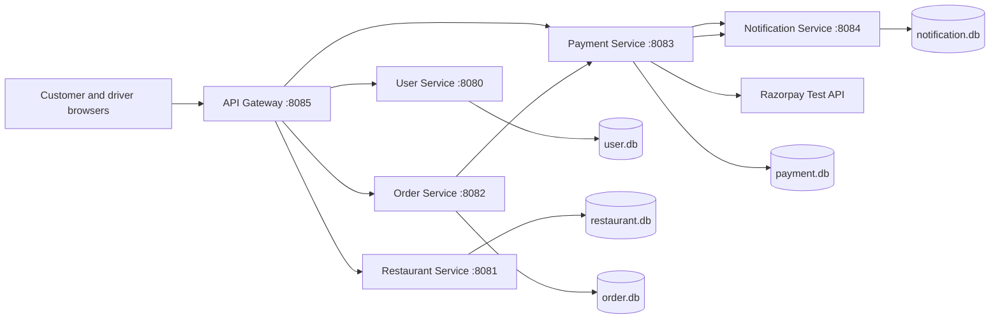
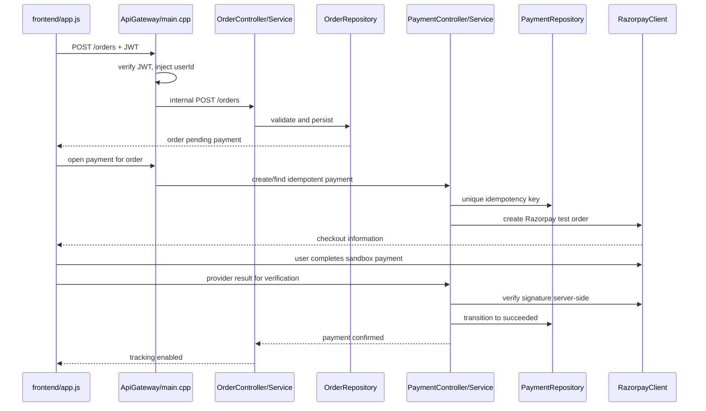

# System Design Concepts Mapped to FoodService Code

This document explains which system-design concepts FoodService uses, why each
concept exists, and the exact source files that implement it. It also separates
implemented behavior from production improvements.

## 1. System overview



The browser calls one public API Gateway. The gateway validates selected public
requests, injects trusted identity, and forwards calls to domain services. Each
service exposes HTTP routes and owns a local SQLite database.

## 2. Quick concept-to-code index

| System-design concept | Main implementation files |
|---|---|
| Microservices and service boundaries | `services/*/src/main.cpp`, root `CMakeLists.txt` |
| API Gateway / reverse proxy | `services/ApiGateway/src/main.cpp`, `services/ApiGateway/src/client/*` |
| Layered architecture | each service's `*Controller.cpp`, `*Service.cpp`, `*Repository.cpp` |
| Database per service | `common/src/Database.cpp`, service `main.cpp` constructors |
| REST CRUD APIs | service `main.cpp` and controller/repository files |
| JWT authentication and ownership | `common/src/JwtManager.cpp`, `services/ApiGateway/src/main.cpp` |
| Password security | `common/src/PasswordHasher.cpp`, `services/UserService/src/UserService.cpp` |
| Idempotency | `OrderService/src/client/PaymentClient.cpp`, `PaymentService/src/PaymentService.cpp`, `common/src/Database.cpp` |
| Thread pools / concurrent requests | each service `src/main.cpp` `.concurrency(...)` or `.multithreaded()` |
| Database concurrency | `common/src/Database.cpp`, `common/include/Database.h`, `OrderRepository.cpp` |
| Payment state machine | `PaymentService/src/PaymentService.cpp`, `PaymentController.cpp` |
| External provider adapter | `PaymentService/src/RazorpayClient.cpp` |
| Real-time status | `PaymentController.cpp`, gateway `main.cpp`, `frontend/app.js` |
| Live GPS tracking | gateway `main.cpp`, `frontend/driver.js`, `frontend/app.js` |
| Backpressure / bounded fan-out | `frontend/app.js` `loadPaymentsBounded()` |
| Load testing | `tests/load_test.py`, `tests/results/load-1000-latest.json` |
| End-to-end and negative testing | `tests/e2e_test.py`, `docs/PAYMENT_DELIVERY_TEST_CASES.md` |
| Configuration and secret injection | `common/src/Config.cpp`, `scripts/start-all.ps1`, `scripts/start-all.sh` |
| Logging / observability | `common/src/Logger.cpp`, service flow logs, `.run/*.log` |

## 3. Microservices and bounded contexts

### Concept

A bounded context groups data and rules that change together. FoodService splits
identity, catalogue, orders, payments, and notifications into separate processes.

### Code

- `services/UserService/src/main.cpp` starts account and login routes.
- `services/RestaurantService/src/main.cpp` starts restaurant CRUD routes.
- `services/OrderService/src/main.cpp` starts order and status routes.
- `services/PaymentService/src/main.cpp` starts payment, webhook, SSE, and Razorpay
  routes.
- `services/NotificationService/src/main.cpp` starts notification CRUD routes.
- Each service has its own `CMakeLists.txt` executable target.
- `scripts/start-all.sh` starts the complete local topology.

### Why it helps

- payment secrets remain inside Payment Service;
- restaurant read traffic can scale independently from order writes;
- teams can change one domain without directly changing every database;
- failures can be isolated by service boundary.

### Current limitation

These services are locally started processes with fixed URLs. There is no service
registry, container scheduler, health-based load balancing, or automatic replica
management. A production deployment would use load balancers and service
discovery, commonly through Kubernetes or a managed platform.

## 4. API Gateway pattern

### Code path

`services/ApiGateway/src/main.cpp` defines the public routes on port 8085. The
clients in `services/ApiGateway/src/client/` forward requests to internal services.
`HttpClient.cpp` contains the reusable outbound HTTP implementation.

Examples:

- `/register` and `/login` are forwarded to User Service;
- `/restaurants` is forwarded to Restaurant Service;
- `/orders` is validated and forwarded to Order Service;
- `/payments` is forwarded to Payment Service with the idempotency header;
- `/orders/{id}/tracking` composes order, payment, and location information.

### Design value

The browser needs only one base URL. Internal ports are hidden, and cross-cutting
rules such as CORS, JWT validation, customer identity injection, and tracking
authorization can be applied centrally.

### Trade-off

The gateway can become a bottleneck or a “god service.” Business rules should
remain in domain services, while the gateway focuses on routing, authentication,
request shaping, aggregation, rate limits, and observability.

## 5. Layered architecture

FoodService uses this internal pattern:

```text
Crow route -> Controller -> Service -> Repository -> SQLite
```

For example, payment creation follows:

1. `services/PaymentService/src/main.cpp` registers `POST /payments`.
2. `PaymentController.cpp::createPayment()` parses and validates HTTP input.
3. `PaymentService.cpp::createPayment()` applies idempotency and business rules.
4. `PaymentRepository.cpp` runs parameterized SQL.
5. `common/src/Database.cpp` owns the SQLite connection and schema.

The same Controller/Service/Repository structure exists in User, Restaurant,
Order, Payment, and Notification services. Controllers know HTTP; services know
business rules; repositories know persistence.

## 6. REST and CRUD design

### User CRUD

- Routes: `services/UserService/src/main.cpp`
- Request validation: `common/src/UserValidator.cpp`
- HTTP mapping: `services/UserService/src/UserController.cpp`
- Password/login logic: `services/UserService/src/UserService.cpp`
- SQL: `services/UserService/src/UserRepository.cpp`

### Restaurant CRUD

- Routes: `services/RestaurantService/src/main.cpp`
- HTTP mapping: `RestaurantController.cpp`
- Business operations: `RestaurantService.cpp`
- SQL: `RestaurantRepository.cpp`

### Order CRUD and status transitions

- Routes: `services/OrderService/src/main.cpp`
- HTTP mapping: `OrderController.cpp`
- Order creation and payment initiation: `OrderService.cpp`
- Persistence and write locking: `OrderRepository.cpp`
- Gateway ownership filtering: `services/ApiGateway/src/main.cpp`

### Payment operations

Payments intentionally do not behave like ordinary CRUD. Creation and reads are
public operations, but status changes occur through verified provider flows.
This prevents arbitrary clients from setting `SUCCEEDED`.

- Routes: `services/PaymentService/src/main.cpp`
- Validation and provider endpoints: `PaymentController.cpp`
- State transitions: `PaymentService.cpp`
- Persistence: `PaymentRepository.cpp`

Payment Service currently has an internal DELETE route, but the API Gateway does
not expose it as part of the public customer payment API. In production, hard
deletion should be restricted because payment history is needed for audit and
reconciliation.

## 7. Authentication, authorization, and trusted identity

### Token creation and verification

- `common/src/JwtManager.cpp` creates JWTs containing the `userId` claim and
  verifies incoming tokens.
- `common/include/JwtMiddleware.h` contains reusable bearer-token middleware.
- `services/UserService/src/UserService.cpp` creates a JWT after successful login.

### Gateway authorization

`services/ApiGateway/src/main.cpp::authenticatedUserId()` reads the
`Authorization: Bearer ...` header, verifies the token, and extracts the user ID.
The gateway then:

- replaces any client-supplied order `userId` with the JWT user ID;
- replaces any client-supplied payment `userId` with the JWT user ID;
- filters order history to the signed-in customer;
- rejects tracking when the order belongs to another customer.

This addresses an important insecure-direct-object-reference risk: the browser
cannot simply claim another customer's numeric ID.

### Password storage

`common/src/PasswordHasher.cpp` hashes and verifies passwords. User Service calls
it rather than storing a plaintext password. Production must use a deliberately
slow adaptive algorithm such as Argon2id or bcrypt with appropriate parameters
and secret rotation policies.

## 8. Database-per-service and data ownership

`common/src/Database.cpp` supplies shared SQLite connection/schema support, but
each process opens its own database file. Service repositories access only their
domain tables.

Benefits:

- a service owns its schema;
- one service cannot silently depend on another service's tables;
- domains can later select different storage technologies.

Cost: there is no SQL join or ACID transaction across service databases. Payment
success and order status therefore cannot be atomically committed together.
Production should use an outbox/event flow and idempotent consumers.

## 9. Idempotency and duplicate protection

Clients retry when networks time out. Without idempotency, one click can create
two payments.

### Code flow

1. `services/OrderService/src/client/PaymentClient.cpp` sends
   `Idempotency-Key: order-{orderId}`.
2. `services/ApiGateway/src/client/PaymentClient.cpp` preserves an incoming key.
3. `PaymentController.cpp::createPayment()` accepts the header or JSON key and
   limits its length.
4. `PaymentService.cpp::createPayment()` first searches for an existing key.
5. `PaymentRepository.cpp::getPaymentByIdempotencyKey()` performs the lookup.
6. `common/src/Database.cpp::createPaymentTable()` creates the unique
   `idempotency_key` constraint/index.

The unique database constraint is the final concurrency-safe guard. An
application-only “check then insert” is insufficient because two threads can
both pass the check before either inserts.

## 10. Multithreading and request concurrency

Crow accepts multiple requests using worker threads:

- API Gateway: `services/ApiGateway/src/main.cpp` uses `.concurrency(128)`.
- Order Service: `services/OrderService/src/main.cpp` uses `.concurrency(128)`.
- Payment Service: `services/PaymentService/src/main.cpp` uses `.concurrency(128)`.
- Restaurant Service: `services/RestaurantService/src/main.cpp` uses
  `.concurrency(64)`.
- Notification Service: `services/NotificationService/src/main.cpp` uses
  `.concurrency(64)`.
- User Service: `services/UserService/src/main.cpp` uses `.multithreaded()`.

This is a bounded-worker design: requests run concurrently, but the server does
not create an unlimited thread per client.

### Important limitation

The internal HTTP clients use blocking calls. A worker waiting for another
service or Razorpay cannot process another request. More workers increase overlap
but also use more memory and database connections. Production tuning must be
based on measured CPU, I/O, downstream latency, queueing, and tail latency—not a
large thread number alone.

## 11. SQLite concurrency control

`common/src/Database.cpp` configures:

- a 30-second `sqlite3_busy_timeout`;
- `PRAGMA journal_mode=WAL`;
- a `std::recursive_mutex` exposed by `common/include/Database.h`.

Repositories use RAII locking. For example,
`services/OrderService/src/OrderRepository.cpp` uses
`std::lock_guard<std::recursive_mutex>` around compound write work.

Why this matters: if thread A inserts a row, thread B inserts another row, and A
then reads `last_insert_rowid()`, A could observe the wrong ID when connection use
is not protected. A mutex and transaction keep the multi-step operation together.

WAL improves reader/writer overlap, but SQLite still has a single-writer
bottleneck. For sustained production concurrency, use PostgreSQL/MySQL with a
connection pool and carefully indexed transactions.

## 12. Payment state machine and provider adapter

`services/PaymentService/src/PaymentService.cpp::applyProviderEvent()` controls
allowed payment state transitions and rejects invalid movement from terminal
states. This is a finite-state-machine concept: not every status can transition
to every other status.

`services/PaymentService/src/RazorpayClient.cpp` is an adapter around Razorpay:

- reads server-side key configuration;
- creates a provider order;
- verifies the payment signature;
- keeps the secret out of frontend JavaScript.

`PaymentController.cpp` exposes the Razorpay order and verification endpoints.
`frontend/payment.js` opens Razorpay Checkout and sends the returned values to
the backend for verification. The client never marks the payment authoritative
by itself.

## 13. Payment-first driver assignment

The customer flow enforces “payment first, driver second”:

- `frontend/payment.js` shows verified success only after the backend response.
- `services/ApiGateway/src/main.cpp` checks payment and order ownership before
  returning tracking data.
- order/payment state is used to gate driver assignment and the Track Driver UI.

This is an invariant: a failed, cancelled, or unverified payment must not dispatch
a driver. Negative scenarios are listed in
`docs/PAYMENT_DELIVERY_TEST_CASES.md`.

## 14. Real-time payment updates: SSE plus polling

`services/PaymentService/src/PaymentController.cpp` and the gateway payment stream
route set `Content-Type: text/event-stream`. The implementation returns a finite
status snapshot with a reconnect hint rather than holding one permanent stream.

`frontend/app.js` uses EventSource where possible and falls back to polling. This
is graceful degradation: checkout can still observe status when SSE is blocked or
unavailable.

Current limitation: this is reconnect-based sampling, not a durable event stream.
At scale, payment events should be durably recorded and distributed through a
broker; WebSocket/SSE fan-out nodes can then subscribe to those events.

## 15. Live driver GPS and freshness

### Driver side

`frontend/driver.js` calls `navigator.geolocation.watchPosition()` and sends each
GPS fix to `/driver/orders/{id}/location` with `X-Driver-Token`.

### Gateway side

`services/ApiGateway/src/main.cpp`:

- validates the driver token;
- upserts the latest coordinate under a database mutex;
- stores accuracy, speed, heading, status, driver, vehicle, and timestamp;
- verifies customer JWT ownership for the tracking read;
- computes location freshness, progress, ETA, and timeline output.

### Customer side

`frontend/app.js::openTracking()` refreshes every five seconds and moves the bike
marker using the returned progress. It labels data stale when a recent driver fix
is unavailable.

The latest-location store is appropriate for the current UI. A production design
would use short-lived scoped driver credentials, a streaming ingestion service,
sequence numbers to reject old updates, a geospatial cache, sampled durable
history, and WebSocket/SSE fan-out.

## 16. External restaurant discovery and geospatial design

`services/ApiGateway/src/main.cpp` exposes `/restaurants/discover`, coordinates
the location request, and integrates provider results with serviceability rules.
`frontend/app.js` obtains browser coordinates with
`navigator.geolocation.getCurrentPosition()` and requests discovery.

The browser location is an input, not trusted authorization. Delivery-zone checks
must remain server-side. For large-scale nearby search, restaurants would be
indexed using geohashes, S2 cells, H3, or a database geospatial index, followed by
exact distance calculation and serviceability filtering.

## 17. Backpressure and bounded fan-out

`frontend/app.js::loadPaymentsBounded(orders, concurrency=8)` uses a small worker
group rather than firing one payment request for every order simultaneously.
This prevents a customer with a large history from creating an unbounded browser
request burst.

Server-side production backpressure would also require:

- edge and per-user rate limits;
- bounded queues and connection pools;
- request deadlines;
- 429/503 responses with retry guidance;
- circuit breakers and retry budgets.

## 18. Configuration and secret management

- `common/src/Config.cpp` reads runtime configuration.
- `services/PaymentService/src/RazorpayClient.cpp` reads Razorpay keys from the
  environment.
- `scripts/start-all.ps1` validates test-key presence, passes variables into WSL,
  and sets the local driver token.
- `scripts/start-all.sh` starts services with the configured environment.

This follows twelve-factor configuration by separating runtime values from code.
For production, use a secrets manager, short-lived service identities, key
rotation, and audit logs. Never expose the Razorpay secret, JWT secret, or driver
token in the frontend or repository.

## 19. Observability and code-flow logs

- `common/src/Logger.cpp` provides common logging support.
- Gateway, Order, and Payment files emit flow messages for accepted and rejected
  operations.
- `scripts/start-all.sh` redirects process output into `.run/*.log`.
- `.run/*.pid` files identify the operating-system process so stop/status scripts
  can manage the correct service; they are not application data.
- `docs/CODEBASE_GUIDE.md` explains the gateway-to-payment-to-order log path.

Production observability should replace free-form output with structured JSON,
propagate a correlation/trace ID, and publish latency, error, saturation, payment,
order, and GPS-freshness metrics. OpenTelemetry can connect frontend, gateway,
service, SQL, and external-provider spans.

## 20. Testing and capacity evidence

### Functional and negative tests

`tests/e2e_test.py` covers health, authentication, CRUD, ownership, order,
idempotent payment, SSE snapshot, webhook rejection, successful transitions, and
notifications. `docs/PAYMENT_DELIVERY_TEST_CASES.md` documents positive and
negative payment/delivery scenarios.

### Load test

`tests/load_test.py` creates concurrent client work and records HTTP success,
throughput, and latency. `tests/results/load-1000-latest.json` records the latest
1,000-client run.

A load-test result proves only the tested workload, machine, build, data, and
dependency configuration. It does not guarantee that every stage—Razorpay,
notifications, GPS, database, and real network users—can sustain 1,000 production
orders indefinitely.

## 21. Concepts planned but not fully implemented

These concepts are recommended in the architecture but are not complete runtime
features today:

| Production concept | Why needed |
|---|---|
| Message broker | durable asynchronous order/payment/notification events |
| Transactional outbox | atomic local write plus eventual event publication |
| Saga/compensation | recover multi-service business workflows |
| Redis | distributed cache, rate limits, and short-lived state |
| Production RDBMS | concurrent writes, replication, backups, pooling |
| Service discovery/load balancing | route across healthy replicas |
| Circuit breaker/bulkhead | contain downstream failure and thread exhaustion |
| Distributed tracing | diagnose latency across service boundaries |
| Container orchestration | health checks, rollout, restart, and autoscaling |
| Multi-region design | geographic availability and disaster recovery |

Do not claim these are implemented during an interview. A strong answer explains
the current synchronous design, identifies its failure modes, and proposes these
as the next production phase.

## 22. Complete order journey with file ownership



## 23. How to explain this in an interview

Use this concise answer:

> FoodService uses domain-oriented C++ microservices behind an API Gateway. Each
> service has Controller, Service, and Repository layers and owns an SQLite
> database. JWT-derived identity protects customer data, idempotency protects
> retryable order/payment creation, Crow worker pools provide request concurrency,
> and WAL plus mutex-protected critical sections protect local database access.
> Razorpay is isolated behind a provider adapter and backend signature verification.
> Payment status uses reconnecting SSE with polling fallback, while driver GPS is
> authorized, timestamped, and exposed only to the owning customer. The current
> system is a tested local architecture; production scale would replace SQLite and
> synchronous propagation with replicated databases, an outbox/message broker,
> service replicas, backpressure, and distributed observability.

## Related documents

- [Architecture](ARCHITECTURE.md)
- [Sequence diagrams](SEQUENCE_DIAGRAMS.md)
- [Concurrency diagrams](CONCURRENCY_DIAGRAMS.md)
- [Interview guide](INTERVIEW_GUIDE.md)
- [System-design questions with code](SYSTEM_DESIGN_QA_WITH_CODE.md)
- [Codebase guide](CODEBASE_GUIDE.md)
- [API reference](API.md)
- [Testing](TESTING.md)
- [Load testing](LOAD_TESTING.md)
